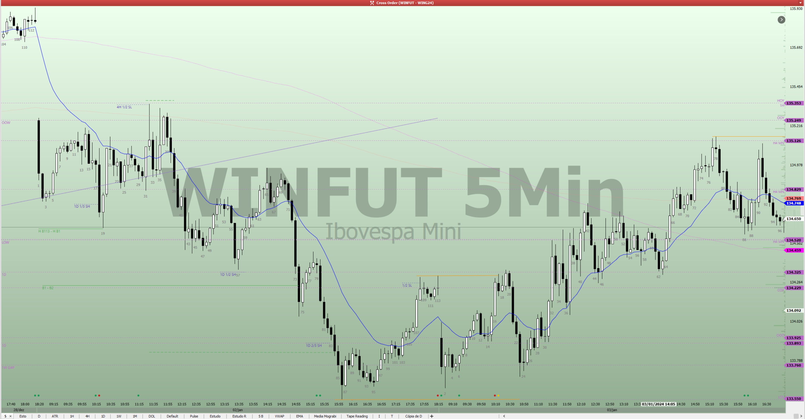

# Janeiro 2024

## Acrônimos

- **PME**: Ponto máximo de equilíbrio
- **DMFV**: Desequilíbrio Muito Forte Vendedor
- **DFOV**: Desequilíbrio Forte Vendedor
- **DFAV**: Desequilíbrio Fraco Vendedor
- **DMFC**: Desequilíbrio Muito Forte Comprador
- **DFOC**: Desequilíbrio Forte Comprador
- **DFAC**: Desequilíbrio Fraco Comprador
- **EQ**: Equilíbrio

## 02 de Janeiro

| Barra | Leitura
|-------|-----
| Pre-Market HTF | **1D Macro** **Desequilíbrio Forte Comprador** após rompimento da lateralidade, retomada de momentum comprador, maior deslocamento de todo o período, sequência de 4 dias de alta com pequeno deslocamento de preço.
| Pre-Market Macro Intraday | **EQ**: Lateralidade entre máxima e mínima do dia, triangulo.  **Baixo 100** **Alto 8**.
| GAP | **DMFV**: Grande GAP 595 PTS, **Momentum Venda**.
| B01 | DMFV: Continuidade, **Momentum Vendedor**. Possível venda de Alta Prob 1X1.
| B02 | DMFV: Continuidade.
| B03 | DMFV: Primeira pequena pausa.
| B04 | DMFV: Pouco deslocamento.
| B05 | **DFAV**: Primeira correção, pequena em relação ao movimento inicial.
| B06 | DFAV: Continuidade da correção. Diminuição de **Momentum Vendedor**
| B07 | DFAV: Pequeno deslocamento de preço, teste do terço superior da lateralidade do dia.
| B08 | DFAV: Pequeno deslocamento de preço
| B09 | DFAV: Pequeno deslocamento de preço
| B10 | DFAV: Pequeno deslocamento de preço
| B11 | DFAV: Pequeno deslocamento de preço
| B12 | DFAV: Teste de Micro Lateralidade, encontrou vendedor acima da região B11.
| B13 | DFAV: Compradores 1/2 Micro Lateralidade.
| B14 | DFAV: **Momentum de Compra**
| B15 | DFAV: Vendedores região Alto B12, **Momentum de Venda**, Bom deslocamento vendedor, teste da EMA
| B16 | DFAV: Pausa, ausência de vendedores abaixo região B15
| B17 | DFAV: **Diminuição Momentum de Venda**,  ausência de vendedores abaixo região B16
| B18 | DFAV: Grande deslocamento **Retomada Momentum de Venda**, primeiro fechamento abaixo de LOD - porem com pequeno deslocamento. Possível aceleração para encontrar compradores.
| B19 | DFAV: Compradores abaixo Região B18. **Diminuição Momentum de Venda**
| B20 | **Eq**: **Momentum de Compra**, bom deslocamento para região de vendedores
| B21 | Eq: Pausa em região Micro Alta, teste ema
| B22 | Eq: Correção Movimento de Alta
| B23 | Eq: Pausa, pequeno deslocamento
| B24 | Eq: Bom deslocamento **Diminuição Momentum de Compra**
| B25 | Eq: Bom deslocamento de compra,  **Aumento Momentum de Compra**, Possível Scalp 1X1 Alta Prob.
| B26 | Eq: Continuação do movimento de Compra
| B27 | Eq: Pausa, ausência de compradores acima da região B26. Possível Short 2X1
| B28 | Eq: **Diminuição Momentum de Compra**, deslocamento de venda
| B29 | Eq: Pausa, compradores abaixo de B28
| B30 | Eq: Pausa, compradores abaixo de B29
| B31 | Eq: **Abertura NY**, Compradores abaixo de B24, bom deslocamento de compra **Retomada Momentum de Compra**.
| B32 | Eq: Vendedores acima de HOD, **Diminuição de Momentum de Compra**.
| B33 | Eq: Bom deslocamento de Venda, Correção Profunda de Movimento Micro.
| B34 | Eq: Pausa
| B35 | Eq: Teste H B1, encontrou vendedores, razoável deslocamento comprador, **Retomada de Momentum de Compra**.
| B36 | Eq: Continuidade Movimento Micro, bom deslocamento, mas sobreposição
| B37 | Eq: Vendedores acima H B36, Sobreposição, **Diminuição de Momentum de Compra**
| B38 | Eq: Teste de Região H B37 encontrou vendedores, pequeno deslocamento vendedor
| B39 | Eq: Bom deslocamento de venda **Momentum Venda**
| B40 | Eq: Continuidade do Momentum de Venda
| B41 | Eq: Pausa do Movimento Micro,  **Diminuição Momentum Venda**
| B42 | Eq: Bom deslocamento de Venda, **Retomada Momentum Venda**

### Aprendizado

#### B15 Compreender melhor o Contexto para Scalp

Havia considerado a B15, como um Scalp Alta Prob, considerando a pressão do GAP de abertura, e o fato de estar no terço superior da lateralidade. Mas mentor pontuou que não havia elementos suficiente para indicar Alta Prob. Entende-se que neste caso considerei a diminuição de momentum comprador como um fator para alta prob, o que não deve ser considerado, seria necessário momentum que veio apenas na B 18, neste caso já baixo.

[Referência](https://discord.com/channels/1156627552388005938/1161431572738748466/1191749626013945856)

## 03 de Janeiro

| Barra | Leitura
|-------|-----
| Pre-Market HTF | **1D Macro** **Desequilíbrio Fraco Comprador** após rompimento da lateralidade, dia anterior realizou a primeira correção considerável (BR Scalp).  Diminuição do Momentum Comprador.
| Pre-Market Macro Intraday | **EQ**: Após nova mínima, dissipação do momentum vendedor, e equilíbrio Lateralidade B107.  **Alto 113** **Baixo 86**.
| GAP | EQ: Grande GAP 595 PTS, **Momentum Venda** Testando Testando Ponto Máximo de Equilíbrio.
| B01 | EQ: Teste do 1/3 Superior encontrou vendedores, forte deslocamento para o terço inferior, continuidade do Momentum de Venda. Porem muito baixo para vender
| B02 | EQ: Teste do fechamento mínimo da lateralidade encontrou compradores, **Diminuição do Momentum de Venda**
| B03 | EQ: Pausa pequeno deslocamento
| B04 | EQ: Teste do menor fechamento do dia, pouco deslocamento, até agora compradores nesta região
| B05 | EQ: Pausa
| B06 | EQ: Pausa
| B07 | EQ: Compradores acima de micro lateralidade (B2 - B6).
| B08 | EQ: Confirmação de Micro **Momentum de Compra**. Ponto máximo de equilíbrio da intenção.
| B09 | EQ: Continuidade Momentum de Compra.
| B10 | EQ: Continuidade Momentum de Compra.
| B11 | EQ: Continuidade Momentum de Compra, compradores do terço superior do Range Intenção (Lateralidade).
| B12 | EQ: Pausa para Momentum de Compra, Micro Possível DFRC, Possível Compra para SCALP 1X1.
| B13 | EQ: Pouco deslocamento continuidade da pausa.
| B14 | EQ: Continuidade da Pausa, compradores abaixo da região L13.
| B15 | EQ: Retomada do Momento Comprador.
| B16 | EQ: Compradores **acima da máxima do dia**, possível teste da máxima da intenção.
| B17 | EQ: Pausa, compradores falharam acima da máxima da intenção. **Diminuição de Momentum de Compra**
| B18 | EQ: Pouco deslocamento
| B19 | EQ: Bom deslocamento, mas insuficiente para modificar Intenção do Preço.
| B20 | EQ: Vendedores na máxima da Intenção do Preço

### 04 de Janeiro

| Barra | Leitura
|-------|-----
| Pre-Market HTF | **1D Macro** **Desequilíbrio Fraco Comprador** contexto de correção, alvos abaixo EMA, pequeno deslocamento
| Pre-Market Macro Intraday | **EQ**: Retomada de alta após teste do 2/3 SH de Macro (1D), Retomada se deu de forma lateral, sem presença compradora. EQ para a intenção  **Alto 78** **Baixo 110**.
| GAP | EQ: Pequeno deslocamento de compra, teste de PME.
| B01 | EQ: Momentum de Venda, bom deslocamento vendedor, Após Teste de PME, .
| B02 | EQ: Pequena continuidade de Venda. Expansão do Range **Baixo B2**.
| B03 | EQ: Pausa, Baixo na região da intenção, expectativa de não termos vendedores nessa região, mas não é possível comprar contra momentum até agora.
| B04 | EQ: Pausa.
| B05 | EQ: Pausa, compradores não atuaram acima da H B4
| B06 | EQ: **Diminuição Momentum de Venda**, bom deslocamento de compra, fechamento acima de Micro Lateralidade (B3 - B5)
| B07 | EQ: Compradores se ausentaram acima de B6.
| B08 | EQ: Retomada de **Momentum de Venda** Baixo na área de equilíbrio. Bom deslocamento mas insuficiente para venda dado o contexto.
| B09 | EQ: Pouco deslocamento de Venda, baixo em área de equilíbrio.
| B10 | EQ: ausência de vendedores na região baixa.
| B11 | EQ: Pausa, ausência de compradores e vendedores.
| B12 | EQ: Nova miníma, mas vendedores se ausentaram. Redefinição de **Novo Baixo**.
| B13 | EQ: Nova miníma, bom deslocamento, região limiar para DMFV. Redefinição de **Novo Baixo**.
| B14 | **DMFV**: Constatação de **Momentum Vendedor** **Novo Baixo**. Definição de Nova Itenção DQMFV.
| B15 | DMFV: Continuidade. Redefinição de **Novo Baixo**.
| B16 | **DFOV**: Correção profunda, definição de nova intenção **Desequilíbrio Forte Vendedor**, dada a primeira pausa e dúvida dos vendedores.
| B17 | DFOV: Continuidade da Pausa.
| B18 | DFOV: Pausa, possivelmente vendedores acima de H B17
| B19 | DFOV: Continuidade  **Momentum Vendedor**, nova mínima
| B20 | DFOV: Continuidade
| B21 | DFOV: Continuidade, porem diminuição do deslocamento de venda
| B22 | DFOV: Continuidade, Ausência de Vendedores abaixo, MM (B78 - B62)
| B23 | DFOV: Pequena Pausa
| B24 | DFOV: Pausa Falta de Compradores acima de B24.
| B25 | DFOV: Pouco deslocamento, menor fechamento do dia.
| B26 | DFOV: Compradores abaixo da mínima do dia.
| B27 | DFOV: Pequeno deslocamento. Pausa
| B28 | DFOV: Pequeno deslocamento. Continuação da Pausa
| B29 | DFOV: Pequeno deslocamento de Venda
| B30 | DFOV: Retomada de Momentum de Venda
| B31 | DFOV: Pausa, **Diminuição de Momentum de Venda**, Teste de Suporte, 1D EMA Macro. Compradores abaixo de LOD. Nova LOD
| B32 | DFOV: Continuidade de Pausa, vendedores acima de H B31.
| B33 | DFOV: Ausência de Vendedores abaixo de L B32. **Equilíbrio de Momentum Venda**
| B34 | DFOV: Ausência de Compradores Acima H B34
| B35 | DFOV: Bom deslocamento de Compra, **Momentum de Compra**. Compra ruim dado que compradores não ganharam Scalp razoável hoje.
| B36 | DFOV: Continuidade Momentum de Compra
| B37 | **DFAV**: Alternância na Intenção, **Desequilíbrio Fraco Vendedor**, Continuidade Momentum de Compra, bom deslocamento, alvo primeiro SCALP compradores, expectativa de vendedores acima do alvo.
| B38 | DFAV: Diminuição de Momentum de Compra. Pausa Movimento Micro, esperado vendedores acima de H B37
| B39 | DFAV: Continuidade da Pausa
| B40 | DFAV: Bom deslocamento de venda. **Diminuição Momentum de Compra**
| B41 | DFAV: Compradores abaixo de L B40. Próximo a PME Micro (B31 - B37)
| B42 | DFAV: Retomada de **Momentum de Compra**, considerando Micro Momentum e Pressão, Possível Trade Alta Prob contra Movimento Principal.
| B43 | DFAV: Continuidade Movimento de Compra.
| B44 | DFAV: Teste de H B37, até agora vendedores nesta região
| B45 | DFAV: Pausa, vendedores H B37.
| B46 | DFAV: Diminuição de **Momentum de Compra**, pausa de movimento Micro. Possível entrada 2X1 pra venda, dada a região alta e diminuição de momentum.
| B47 | DFAV: **Momentum Venda**, pequeno deslocamento de Venda.
| B48 | DFAV: Continuidade deslocamento de Venda, pequeno deslocamento.
| B49 | DFAV: Continuidade deslocamento de Venda, pequeno deslocamento. Micro vendedores vendendo valor dentro do período, pequeno deslocamento de preço.
| B50 | DFAV: Pausa. **Diminuição Momentum de Venda** compradores abaixo de L B49, terço inferior lateralidade em lateralidade Micro (B41 - B47)
| B51 | DFAV: Bom deslocamento de Compra **Retomada de Momentum de Compra**. Possível Scalp
| B52 | DFAV: Pausa, vendedores acima de H B48.
| B53 | DFAV: Continuidade de Momentum de Compra, com com deslocamento, mas sobreposição, espera-se vendedores acima. H B45
| B54 | DFAV: **Diminuição Acentuada de Momentum de Compra**, Vendedores acima de B53. Possível Baixa Prob.
| B55 | DFAV: **Momentum de Venda**, ótimo deslocamento, possível Alta Prob. Possível retomado do movimento principal.
| B56 | DFAV: Pausa movimento principal, pequeno deslocamento.
| B57 | DFAV: Pequeno deslocamento de venda, compradores abaixo de L B55.
| B58 | DFAV: Pausa, pequeno deslocamento de venda
| B59 | DFAV: Continuidade do movimento principal, pequeno deslocamento.
| B60 | DFAV: Pequena pausa, pouco deslocamento.
| B61 | DFAV: Pequeno deslocamento, compradores abaixo de B59, mas compradores atuando somente em região de valor, a 8 barras compradores não pagam caro dentro da possibilidade.
| B62 | DFAV: Pequena Pausa
| B63 | DFAV: Compradores abaixo de L B61
| B64 | DFAV: Pequena Pausa
| B65 | DFAV: Bom deslocamento, porem sobreposição, compradores abaixo de B64
| B66 | DFAV: Pequena Pausa, sobreposição
| B67 | DFAV: Compradores na mínima do dia, **Diminuição Momentum de Venda**
| B68 | DFAV: Bom deslocamento de compra, **Diminuição Acentuada Momentum de Venda**. Porém Micro Pressão Vendedora, menor probabilidade de reversão.
| B69 | DFAV: Retomada de **Momentum de Venda**, bom deslocamento, possível Trade Alta Prob
| B70 | DFAV: Pequeno deslocamento vendedor, compradores abaixo de L B67, continuidade do movimento.

## Relatório Modelo

### Dias do Mês

| Barra | Leitura
|-------|-----
| Pre-Market HTF | **1D Macro** **Desequilíbrio Forte Comprador** após rompimento da lateralidade, retomada de momentum comprador, maior deslocamento de todo o período, sequência de 4 dias de alta com pequeno deslocamento de preço.
| Pre-Market Macro Intraday | **EQ**: Lateralidade entre máxima e mínima do dia, triangulo.  **Baixo 100** **Alto 8**.
| GAP | **DMFV**: Grande GAP 595 PTS, **Momentum Venda**.
| B01 |
| B02 |
| B03 |
| B04 |
| B05 |
| B06 |
| B07 |
| B08 |
| B09 |
| B10 |
| B11 |
| B12 |
| B13 |
| B14 |
| B15 |
| B16 |
| B17 |
| B18 |
| B19 |
| B20 |
| B21 |
| B22 |
| B23 |
| B24 |
| B25 |
| B26 |
| B27 |
| B28 |
| B29 |
| B30 |
| B31 |
| B32 |
| B33 |
| B34 |
| B35 |
| B36 |
| B37 |
| B38 |
| B39 |
| B40 |
| B41 |
| B42 |
| B43 |
| B44 |
| B45 |
| B46 |
| B47 |
| B48 |
| B49 |
| B50 |
| B51 |
| B52 |
| B53 |
| B54 |
| B55 |
| B56 |
| B57 |
| B58 |
| B59 |
| B60 |
| B61 |
| B62 |
| B63 |
| B64 |
| B65 |
| B66 |
| B67 |
| B68 |
| B69 |
| B70 |
