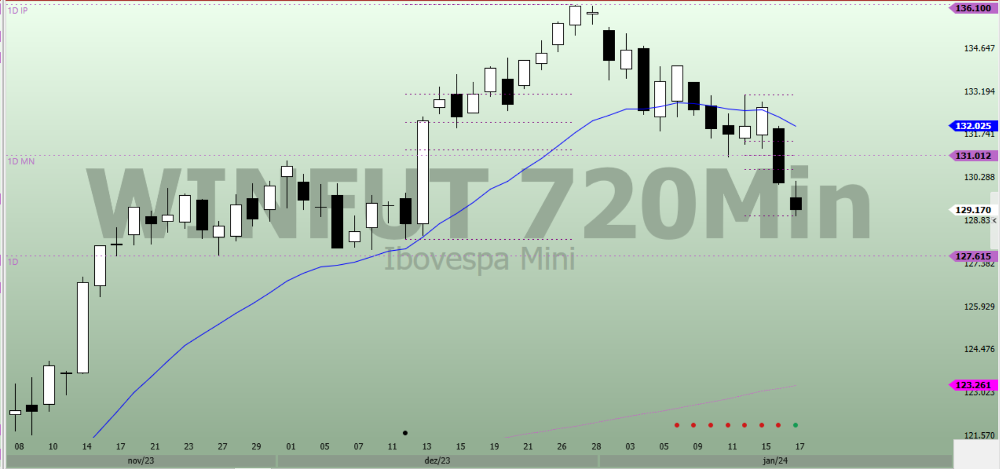
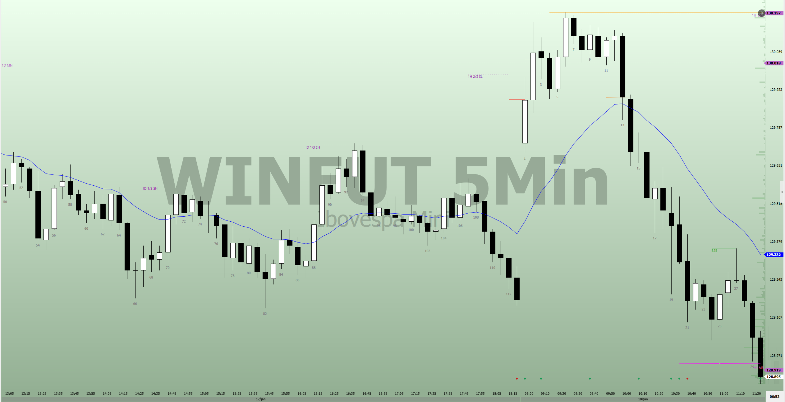
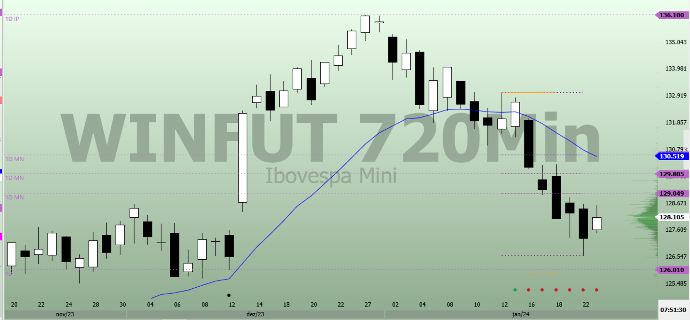
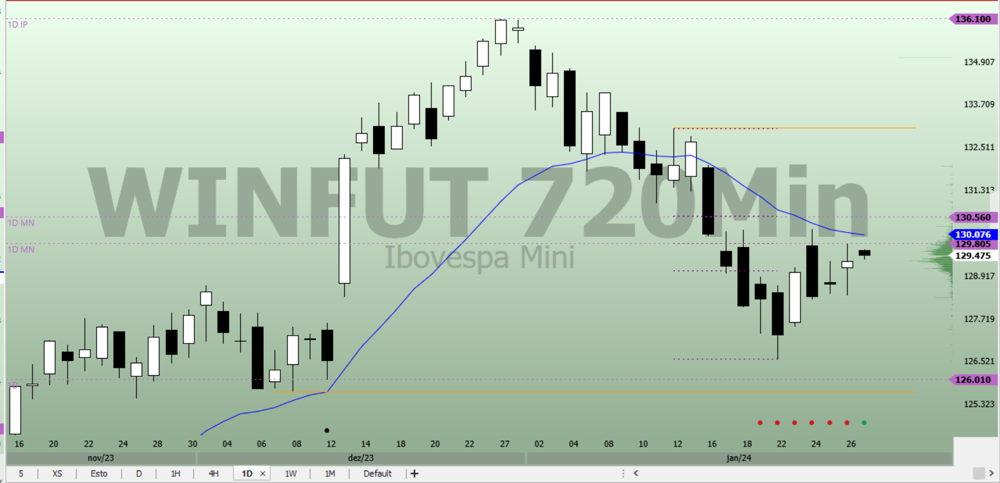
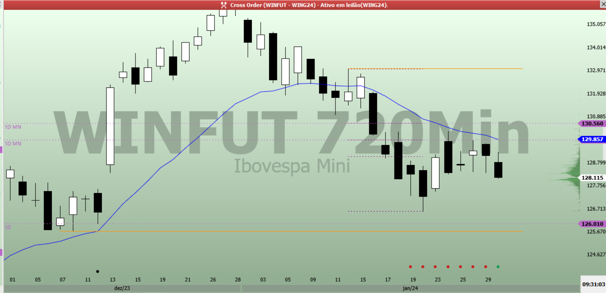

# Janeiro 2024

## Abreviações Definições

- **PME**: Ponto máximo de equilíbrio
- **DMFV**: Desequilíbrio Muito Forte Vendedor
- **DFOV**: Desequilíbrio Forte Vendedor
- **DFAV**: Desequilíbrio Fraco Vendedor
- **DMFC**: Desequilíbrio Muito Forte Comprador
- **DFOC**: Desequilíbrio Forte Comprador
- **DFAC**: Desequilíbrio Fraco Comprador
- **EQ**: Equilíbrio
- **LE**: Referência de **Limiar de Equilíbrio** (20% do Equilíbrio Atual)  

## Relatório Modelo

### Dias do Mês - Macro Intraday

| Barra | Leitura
|-------|-----
| Pre-Market Macro | **Macro** **Desequilíbrio Forte Comprador**
| Pre-Market Macro Intraday | **EQ**:  **Baixo 100** **Alto 8**
| GAP | **DMFV**: Grande GAP 595 PTS, **Momentum Venda**
| B01 |
| B02 |
| B03 |
| B04 |
| B05 |
| B06 |
| B07 |
| B08 |
| B09 |
| B10 |
| B11 |
| B12 |
| B13 |
| B14 |
| B15 |
| B16 |
| B17 |
| B18 |
| B19 |
| B20 |
| B21 |
| B22 |
| B23 |
| B24 |
| B25 |
| B26 |
| B27 |
| B28 |
| B29 |
| B30 |
| B31 |
| B32 |
| B33 |
| B34 |
| B35 |
| B36 |
| B37 |
| B38 |
| B39 |
| B40 |
| B41 |
| B42 |
| B43 |
| B44 |
| B45 |
| B46 |
| B47 |
| B48 |
| B49 |
| B50 |
| B51 |
| B52 |
| B53 |
| B54 |
| B55 |
| B56 |
| B57 |
| B58 |
| B59 |
| B60 |
| B61 |
| B62 |
| B63 |
| B64 |
| B65 |
| B66 |
| B67 |
| B68 |
| B69 |
| B70 |

### Dias do Mês - Micro

| Barra | Leitura
|-------|-----
| GAP | **DMFV**: Grande GAP 595 PTS, **Momentum Venda**
| B01 |
| B02 |
| B03 |
| B04 |
| B05 |
| B06 |
| B07 |
| B08 |
| B09 |
| B10 |
| B11 |
| B12 |
| B13 |
| B14 |
| B15 |
| B16 |
| B17 |
| B18 |
| B19 |
| B20 |
| B21 |
| B22 |
| B23 |
| B24 |
| B25 |
| B26 |
| B27 |
| B28 |
| B29 |
| B30 |
| B31 |
| B32 |
| B33 |
| B34 |
| B35 |
| B36 |
| B37 |
| B38 |
| B39 |
| B40 |
| B41 |
| B42 |
| B43 |
| B44 |
| B45 |
| B46 |
| B47 |
| B48 |
| B49 |
| B50 |
| B51 |
| B52 |
| B53 |
| B54 |
| B55 |
| B56 |
| B57 |
| B58 |
| B59 |
| B60 |
| B61 |
| B62 |
| B63 |
| B64 |
| B65 |
| B66 |
| B67 |
| B68 |
| B69 |
| B70 |

## 02 de Janeiro

| Barra | Leitura
|-------|-----
| Pre-Market HTF | **1D Macro** **Desequilíbrio Forte Comprador** após rompimento da lateralidade, retomada de momentum comprador, maior deslocamento de todo o período, sequência de 4 dias de alta com pequeno deslocamento de preço| Pre-Market Macro Intraday | **EQ**: Lateralidade entre máxima e mínima do dia, triangulo.  **Baixo 100** **Alto 8**| GAP | **DMFV**: Grande GAP 595 PTS, **Momentum Venda**
| B01 | DMFV: Continuidade, **Momentum Vendedor**. Possível venda de Alta Prob 1X1
| B02 | DMFV: Continuidade
| B03 | DMFV: Primeira pequena pausa
| B04 | DMFV: Pouco deslocamento
| B05 | **DFAV**: Primeira correção, pequena em relação ao movimento inicial
| B06 | DFAV: Continuidade da correção. Diminuição de **Momentum Vendedor**
| B07 | DFAV: Pequeno deslocamento de preço, teste do terço superior da lateralidade do dia
| B08 | DFAV: Pequeno deslocamento de preço
| B09 | DFAV: Pequeno deslocamento de preço
| B10 | DFAV: Pequeno deslocamento de preço
| B11 | DFAV: Pequeno deslocamento de preço
| B12 | DFAV: Teste de Micro Lateralidade, encontrou vendedor acima da região B11
| B13 | DFAV: Compradores 1/2 Micro Lateralidade
| B14 | DFAV: **Momentum de Compra**
| B15 | DFAV: Vendedores região Alto B12, **Momentum de Venda**, Bom deslocamento vendedor, teste da EMA
| B16 | DFAV: Pausa, ausência de vendedores abaixo região B15
| B17 | DFAV: **Diminuição Momentum de Venda**,  ausência de vendedores abaixo região B16
| B18 | DFAV: Grande deslocamento **Retomada Momentum de Venda**, primeiro fechamento abaixo de LOD - porem com pequeno deslocamento. Possível aceleração para encontrar compradores
| B19 | DFAV: Compradores abaixo Região B18. **Diminuição Momentum de Venda**
| B20 | **Eq**: **Momentum de Compra**, bom deslocamento para região de vendedores
| B21 | Eq: Pausa em região Micro Alta, teste ema
| B22 | Eq: Correção Movimento de Alta
| B23 | Eq: Pausa, pequeno deslocamento
| B24 | Eq: Bom deslocamento **Diminuição Momentum de Compra**
| B25 | Eq: Bom deslocamento de compra,  **Aumento Momentum de Compra**, Possível Scalp 1X1 Alta Prob
| B26 | Eq: Continuação do movimento de Compra
| B27 | Eq: Pausa, ausência de compradores acima da região B26. Possível Short 2X1
| B28 | Eq: **Diminuição Momentum de Compra**, deslocamento de venda
| B29 | Eq: Pausa, compradores abaixo de B28
| B30 | Eq: Pausa, compradores abaixo de B29
| B31 | Eq: **Abertura NY**, Compradores abaixo de B24, bom deslocamento de compra **Retomada Momentum de Compra**
| B32 | Eq: Vendedores acima de HOD, **Diminuição de Momentum de Compra**
| B33 | Eq: Bom deslocamento de Venda, Correção Profunda de Movimento Micro
| B34 | Eq: Pausa
| B35 | Eq: Teste H B1, encontrou vendedores, razoável deslocamento comprador, **Retomada de Momentum de Compra**
| B36 | Eq: Continuidade Movimento Micro, bom deslocamento, mas sobreposição
| B37 | Eq: Vendedores acima H B36, Sobreposição, **Diminuição de Momentum de Compra**
| B38 | Eq: Teste de Região H B37 encontrou vendedores, pequeno deslocamento vendedor
| B39 | Eq: Bom deslocamento de venda **Momentum Venda**
| B40 | Eq: Continuidade do Momentum de Venda
| B41 | Eq: Pausa do Movimento Micro,  **Diminuição Momentum Venda**
| B42 | Eq: Bom deslocamento de Venda, **Retomada Momentum Venda**

### Aprendizado

#### B15 Compreender melhor o Contexto para Scalp

Havia considerado a B15, como um Scalp Alta Prob, considerando a pressão do GAP de abertura, e o fato de estar no terço superior da lateralidade. Mas mentor pontuou que não havia elementos suficiente para indicar Alta Prob. Entende-se que neste caso considerei a diminuição de momentum comprador como um fator para alta prob, o que não deve ser considerado, seria necessário momentum que veio apenas na B 18, neste caso já baixo

[Referência](https://discord.com/channels/1156627552388005938/1161431572738748466/1191749626013945856)

## 03 de Janeiro

| Barra | Leitura
|-------|-----
| Pre-Market HTF | **1D Macro** **Desequilíbrio Fraco Comprador** após rompimento da lateralidade, dia anterior realizou a primeira correção considerável (BR Scalp).  Diminuição do Momentum Comprador
| Pre-Market Macro Intraday | **EQ**: Após nova mínima, dissipação do momentum vendedor, e equilíbrio Lateralidade B107.  **Alto 113** **Baixo 86**
| GAP | EQ: Grande GAP 595 PTS, **Momentum Venda** Testando Testando Ponto Máximo de Equilíbrio
| B01 | EQ: Teste do 1/3 Superior encontrou vendedores, forte deslocamento para o terço inferior, continuidade do Momentum de Venda. Porem muito baixo para vender
| B02 | EQ: Teste do fechamento mínimo da lateralidade encontrou compradores, **Diminuição do Momentum de Venda**
| B03 | EQ: Pausa pequeno deslocamento
| B04 | EQ: Teste do menor fechamento do dia, pouco deslocamento, até agora compradores nesta região
| B05 | EQ: Pausa
| B06 | EQ: Pausa
| B07 | EQ: Compradores acima de micro lateralidade (B2 - B6)
| B08 | EQ: Confirmação de Micro **Momentum de Compra**. Ponto máximo de equilíbrio da intenção
| B09 | EQ: Continuidade Momentum de Compra
| B10 | EQ: Continuidade Momentum de Compra
| B11 | EQ: Continuidade Momentum de Compra, compradores do terço superior do Range Intenção (Lateralidade)
| B12 | EQ: Pausa para Momentum de Compra, Micro Possível DFRC, Possível Compra para SCALP 1X1
| B13 | EQ: Pouco deslocamento continuidade da pausa
| B14 | EQ: Continuidade da Pausa, compradores abaixo da região L13
| B15 | EQ: Retomada do Momento Comprador
| B16 | EQ: Compradores **acima da máxima do dia**, possível teste da máxima da intenção
| B17 | EQ: Pausa, compradores falharam acima da máxima da intenção. **Diminuição de Momentum de Compra**
| B18 | EQ: Pouco deslocamento
| B19 | EQ: Bom deslocamento, mas insuficiente para modificar Intenção do Preço
| B20 | EQ: Vendedores na máxima da Intenção do Preço

## 04 de Janeiro

| Barra | Leitura
|-------|-----
| Pre-Market HTF | **1D Macro** **Desequilíbrio Fraco Comprador** contexto de correção, alvos abaixo EMA, pequeno deslocamento
| Pre-Market Macro Intraday | **EQ**: Retomada de alta após teste do 2/3 SH de Macro (1D), Retomada se deu de forma lateral, sem presença compradora. EQ para a intenção  **Alto 78** **Baixo 110**
| GAP | EQ: Pequeno deslocamento de compra, teste de PME
| B01 | EQ: Momentum de Venda, bom deslocamento vendedor, Após Teste de PME
| B02 | EQ: Pequena continuidade de Venda. Expansão do Range **Baixo B2**
| B03 | EQ: Pausa, Baixo na região da intenção, expectativa de não termos vendedores nessa região, mas não é possível comprar contra momentum até agora
| B04 | EQ: Pausa
| B05 | EQ: Pausa, compradores não atuaram acima da H B4
| B06 | EQ: **Diminuição Momentum de Venda**, bom deslocamento de compra, fechamento acima de Micro Lateralidade (B3 - B5)
| B07 | EQ: Compradores se ausentaram acima de B6
| B08 | EQ: Retomada de **Momentum de Venda** Baixo na área de equilíbrio. Bom deslocamento mas insuficiente para venda dado o contexto
| B09 | EQ: Pouco deslocamento de Venda, baixo em área de equilíbrio
| B10 | EQ: Ausência de vendedores na região baixa
| B11 | EQ: Pausa, ausência de compradores e vendedores
| B12 | EQ: Nova miníma, mas vendedores se ausentaram. Redefinição de **Novo Baixo**
| B13 | EQ: Nova miníma, bom deslocamento, região limiar para DMFV. Redefinição de **Novo Baixo**
| B14 | **DMFV**: Constatação de **Momentum Vendedor** **Novo Baixo**. Definição de Nova Intenção **Desequilíbrio Muito Forte Vendedor**
| B15 | DMFV: Continuidade. Redefinição de **Novo Baixo**
| B16 | **DFOV**: Correção profunda, definição de nova intenção **Desequilíbrio Forte Vendedor**, dada a primeira pausa e dúvida dos vendedores
| B17 | DFOV: Continuidade da Pausa
| B18 | DFOV: Pausa, possivelmente vendedores acima de H B17
| B19 | DFOV: Continuidade  **Momentum Vendedor**, nova mínima
| B20 | DFOV: Continuidade
| B21 | DFOV: Continuidade, porem diminuição do deslocamento de venda
| B22 | DFOV: Continuidade, Ausência de Vendedores abaixo, MM (B78 - B62)
| B23 | DFOV: Pequena Pausa
| B24 | DFOV: Pausa Falta de Compradores acima de B24
| B25 | DFOV: Pouco deslocamento, menor fechamento do dia
| B26 | DFOV: Compradores abaixo da mínima do dia
| B27 | DFOV: Pequeno deslocamento. Pausa
| B28 | DFOV: Pequeno deslocamento. Continuação da Pausa
| B29 | DFOV: Pequeno deslocamento de Venda
| B30 | DFOV: Retomada de Momentum de Venda
| B31 | DFOV: Pausa, **Diminuição de Momentum de Venda**, Teste de Suporte, 1D EMA Macro. Compradores abaixo de LOD. Nova LOD
| B32 | DFOV: Continuidade de Pausa, vendedores acima de H B31
| B33 | DFOV: Ausência de Vendedores abaixo de L B32. **Equilíbrio de Momentum Venda**
| B34 | DFOV: Ausência de Compradores Acima H B34
| B35 | DFOV: Bom deslocamento de Compra, **Momentum de Compra**. Compra ruim dado que compradores não ganharam Scalp razoável hoje
| B36 | DFOV: Continuidade Momentum de Compra
| B37 | **DFAV**: Alternância na Intenção, **Desequilíbrio Fraco Vendedor**, Continuidade Momentum de Compra, bom deslocamento, alvo primeiro SCALP compradores, expectativa de vendedores acima do alvo
| B38 | DFAV: Diminuição de Momentum de Compra. Pausa Movimento Micro, esperado vendedores acima de H B37
| B39 | DFAV: Continuidade da Pausa
| B40 | DFAV: Bom deslocamento de venda. **Diminuição Momentum de Compra**
| B41 | DFAV: Compradores abaixo de L B40. Próximo a PME Micro (B31 - B37)
| B42 | DFAV: Retomada de **Momentum de Compra**, considerando Micro Momentum e Pressão, Possível Trade Alta Prob contra Movimento Principal
| B43 | DFAV: Continuidade Movimento de Compra
| B44 | DFAV: Teste de H B37, até agora vendedores nesta região
| B45 | DFAV: Pausa, vendedores H B37
| B46 | DFAV: Diminuição de **Momentum de Compra**, pausa de movimento Micro. Possível entrada 2X1 pra venda, dada a região alta e diminuição de momentum
| B47 | DFAV: **Momentum Venda**, pequeno deslocamento de Venda
| B48 | DFAV: Continuidade deslocamento de Venda, pequeno deslocamento
| B49 | DFAV: Continuidade deslocamento de Venda, pequeno deslocamento. Micro vendedores vendendo valor dentro do período, pequeno deslocamento de preço
| B50 | DFAV: Pausa. **Diminuição Momentum de Venda** compradores abaixo de L B49, terço inferior lateralidade em lateralidade Micro (B41 - B47)
| B51 | DFAV: Bom deslocamento de Compra **Retomada de Momentum de Compra**. Possível Scalp
| B52 | DFAV: Pausa, vendedores acima de H B48
| B53 | DFAV: Continuidade de Momentum de Compra, com com deslocamento, mas sobreposição, espera-se vendedores acima. H B45
| B54 | DFAV: **Diminuição Acentuada de Momentum de Compra**, Vendedores acima de B53. Possível Baixa Prob
| B55 | DFAV: **Momentum de Venda**, ótimo deslocamento, possível Alta Prob. Possível retomado do movimento principal
| B56 | DFAV: Pausa movimento principal, pequeno deslocamento
| B57 | DFAV: Pequeno deslocamento de venda, compradores abaixo de L B55
| B58 | DFAV: Pausa, pequeno deslocamento de venda
| B59 | DFAV: Continuidade do movimento principal, pequeno deslocamento
| B60 | DFAV: Pequena pausa, pouco deslocamento
| B61 | DFAV: Pequeno deslocamento, compradores abaixo de B59, mas compradores atuando somente em região de valor, a 8 barras compradores não pagam caro dentro da possibilidade
| B62 | DFAV: Pequena Pausa
| B63 | DFAV: Compradores abaixo de L B61
| B64 | DFAV: Pequena Pausa
| B65 | DFAV: Bom deslocamento, porem sobreposição, compradores abaixo de B64
| B66 | DFAV: Pequena Pausa, sobreposição
| B67 | DFAV: Compradores na mínima do dia, **Diminuição Momentum de Venda**
| B68 | DFAV: Bom deslocamento de compra, **Diminuição Acentuada Momentum de Venda**. Porém Micro Pressão Vendedora, menor probabilidade de reversão
| B69 | DFAV: Retomada de **Momentum de Venda**, bom deslocamento, possível Trade Alta Prob
| B70 | DFAV: Pequeno deslocamento vendedor, compradores abaixo de L B67, continuidade do movimento

## 05 de Janeiro

| Barra | Leitura
|-------|-----
| Pre-Market HTF | **1D Macro** **EQ** Teste da mínima do movimento de alta, testando também 1D EMA. Movimento feito com bom deslocamento **Momentum de Baixa**. É esperado compradores nesta região pois esta é uma região de valor.
| Pre-Market Macro Intraday | **EQ**: Dia teve forte movimento de baixa, e acabou com um equilíbrio com um range pequeno. Fechamento próximo à mínima.  **Baixo 87** **Alto 103**
| GAP | **EQ**: **Momentum de Venda**, testando região de limite do equilíbrio
| B01 | EQ: Grande deslocamento para os dois lados, indecisão, teste de limite mínimo, vendedores hesitaram.
| B02 | EQ: **Diminuição de Momentum de Venda**, bom deslocamento de compra.
| B03 | EQ: Continuidade Micro Movimento, pequeno deslocamento, ausência de compradores acima da região B1. **Momentum de Venda Dissipado**.
| B04 | EQ: Bom deslocamento, Retomada de **Momentum de Venda**
| B05 | EQ: Pausa, vendedores hesitaram abaixo da região de B4
| B06 | EQ: Bom deslocamento de Venda, fechamento abaixo da região limite do equilíbrio, mas pouco deslocamento.
| B07 | EQ: Pequeno deslocamento, menor fechamento do dia.
| B08 | EQ: Pausa, nenhum deslocamento, vendedores ausente abaixo da regi,ao de B1.
| B09 | EQ: **Diminuição de Momentum de Venda**
| B10 | EQ: Compradores ausente acima da região alta de B09, bom deslocamento de venda.
| B11 | EQ: **Retomada de Momentum de Venda**, porem vendedores se ausentaram abaixo de B8
| B12 | EQ: Pausa, pequeno deslocamento
| B13 | EQ: Vendedores se ausentaram abaixo de B8, diminuição de **Momentum de Venda**, bom deslocamento de Compra, **Momentum de Compra**
| B14 | EQ: Bom deslocamento de Compra, Continuidade de Momentum de Compra. Possível Compra 2x1. Redefinição de **Baixo B13**, dada até agora a ausência de vendedores. **Momentum de Venda Dissipado**
| B15 | EQ: Grande deslocamento de Compra, fechamento no terço superior do Equilíbrio.
| B16 | EQ: Pausa, ausência de compradores acima de B15.
| B17 | EQ: Micro Correção Movimento de Alta, **Diminuição de Momentum de Compra**
| B18 | EQ: Volatilidade, compradores ausente acima de B16 - terço superior do Equilíbrio. vendedores ausente abaixo de B17. Pequeno deslocamento.
| B19 | EQ: Noticia, Volatilidade, vendedores ausentes na mínima do Equilíbrio, como também na mínima da B18. Por fim muito susto pra pouca força :). **Momentum de Compra dissipado**. Definição de **Novo Baixo B19**
| B20 | EQ: Pequeno deslocamento, Equilíbrio.

## 08 de Janeiro

| Barra | Leitura
|-------|-----
| Pre-Market HTF | **1D Macro** **EQ** Teste da mínima do movimento de alta, testando também 1D EMA. Movimento feito com bom deslocamento **Momentum de Baixa**. Ausência de Vendedores na mínima do movimento anterior, **Diminuição no Momentum de Baixa**.
| Pre-Market Macro Intraday | **EQ**: Após fazer nova máxima, ausência de compradores, aumento de **Momentum Vendedor** teste do PME para a amplitude Macro Intraday, criando um novo equilíbrio. **Baixo 77** **Alto 113**
| GAP | **EQ**: **Momentum de Venda**, grande deslocamento de preço, abrangendo todo equilíbrio, testando região Baixa. Não são esperados vendedores abaixo de Baixo.
| B01 | **DMFV**: Vendedores venderam abaixo de Baixo, Novo **Baixo B1**, Continuação do **Momentum Vendedor**. Bom deslocamento, possível entrada Scalp Venda 1X1.
| B02 | DMFV: Continuidade do Momentum de Venda
| B03 | **DFAV**: Grande Correção, Atingindo 2/3 Micro, alternância de intenção para **Desequilíbrio Fraco Vendedor**, Diminuição Acentuada de **Momentum Vendedor**. Grande deslocamento, mas não se pode considerar compras no momento. Dado do grande deslocamento, abre-se a hipótese de considerar B1 - B2, como uma expansão do equilíbrio anterior.
| B04 | DFAV: Ausência de Compradores Acima da Máxima anterior, pequeno deslocamento. Nada Muda
| B05 | DFAV: Pequeno deslocamento de Venda
| B06 | DFAV: **Dissipação do Momentum de Venda**
| B07 | DFAV: Pequeno deslocamento
| B08 | DFAV: Ausência de compradores acima das máximas anteriores, pequeno deslocamento
| B09 | DFAV: Copradores baixo das mínimas anteriores, Pequeno Momentum Comprador.
| B10 | DFAV: Continuidade, pouco deslocamento, Ausência de Compradores acima das máxima anteriores.
| B11 | DFAV: Pausa, pequeno deslocamento
| B12 | DFAV: Pequeno deslocamento, Ausência de Compradores acima das máxima anteriores.
| B13 | DFAV: Ausência de Compradores acima das máxima anteriores
| B14 | DFAV: Retomada de **Momentum para o movimento Principal**, possível Scalp 1X1 pra venda. Bom deslocamento vendedor.
| B15 | DFAV: Continuidade
| B16 | DFAV: Vendedores acima da máxima anterior, reforçando Momentum de Venda
| B17 | DFAV: Correção, diminuição do Momentum de Venda
| B18 | DFAV: Retomada de Momentum de Venda, Vendedores acima de Máximas anteriores. Alvo 1X1 Atingido
| B19 | DFAV: Diminuição de Momentum de Venda, com deslocamento comprador, possível Micro Equilíbrio.
| B20 | Pausa, Micro, compradores atuando em valor no período.

## 09 de Janeiro

| Barra | Leitura
|-------|-----
| Pre-Market HTF | **1D Macro** **Desequilíbrio Fraco Comprador** Teste da extremidade do movimento anterior com **Forte Momentum Vendedor**. Considerável dissipação de Momentum Vendedor, testando PME. Considerando Momentum Comprador é possível compradores acima de PME, mas existem também a possibilidade da busca de valor na região das mínimas.
| Pre-Market Macro Intraday | **DMFC**: Fechamento na máxima, **Alto B43 (D-2)**,  **Baixo B99**.
| GAP | **EQ**: Grande deslocamento de Venda, **Momentum de Venda** Abertura próximo pouco abaixo de  **Baixo B99**. Considerando que o GAP abriu abaixo do Equilíbrio Definido no Pre-Market iremos utilizar uma nova referência para **Baixo B83**.
| B01 | EQ: Continuidade do Momentum de Venda, deslocamento de preço para Baixo B83.
| B02 | EQ: Continuidade do Momentum de Venda, bom deslocamento de preço para abaixo de Baixo Baixo B83, porem dentro de LE (Limiar de Equilíbrio - 20% do Equilíbrio Atual).
| B03 | EQ: Primeira pausa em Momentum de Venda. Pequeno deslocamento em relação aos movimentos anteriores.
| B04 | EQ: Retomada de Momentum de Venda, Teste de LE, bom deslocamento, porem sobreposição, Vendedores não são esperados abaixo dessa região
| B05 | EQ: Pequeno deslocamento, porem nova miníma.
| B06 | EQ: Pequeno deslocamento, porem nova miníma, **diminuição de Momentum de Venda**.
| B07 | EQ: Médio deslocamento, nova mínima, porem inconclusivo para alternar a intenção do Preço. Nova mínima, vendedores não se apresentaram com força abaixo da região da Minima de B4. Não é possível determinar vendedores abaixo de LE.
| B08 | EQ: Dissipação de **Momentum Vendedor** próximo à alvo de Scalp de B1. Mas pouco Momentum ainda para considerar um 2X1 pra compra. **Momentum de Compra**.
| B09 | EQ: Ausência de compradores acima da máxima de B8.
| B10 | EQ: Pequeno deslocamento. **Diminuição Momentum de Compra**.
| B11 | EQ: Ausência de Vendedores na Miníma do Dia. Compradores atuando em valor nesse período.
| B12 | EQ: Retomada de Momentum de Compra, bom deslocamento, porem dentro de regi,ao de Micro Equilíbrio.
| B13 | EQ: Alternância de **Momentum para Venda**, bom deslocamento, nova mínima, porem inconclusiva a presença de vendedores abaixo de LE
| B14 | EQ: Continuidade do Momentum de Venda, pouco deslocamento, e ausência de vendedores abaixo na mínima no dia.
| B15 | EQ: Pausa, ausência de compradores acima da máxima da Barra Anterior e abaixo da barra anterior. Comportamento Lateral. Diminuição de Momentum de Venda
| B16 | **DMFV**: Alteração de Intenção para **Desequilíbrio Muito Forte Vendedor**, vendedores venderam muito abaixo de LE. Bom deslocamento.
| B17 | DMFV: Continuidade do movimento, bom deslocamento.
| B18 | DFOV: Primeira pausa, diminuição acentuada do **Momentum Vendedor**
| B19 | DFOV: Dissipação do Momentum Vendedor. Momentum de Compra.
| B20 | DFAV: Pequeno deslocamento, ausência de compradores acima.
| B21 | DFAV: Diminuição de Momentum de Compra, bom deslocamento vendedor. Porem Micro Força compradora.
| B22 | EQ: Ausência de vendedores em micro região de valor de compra, **Momentum de Compra**, bom deslocamento. Nova intenção **Equilíbrio**, motivos para determinar a intenção. **Micro Momentum de Compra** e **Micro Força Compradora** testando região de Valor Anterior.

**Auto-Analise**: Analisando à posteriori, entende-se que poderia ter sido determinado **Desequilíbrio Muito Forte Vendedor** já em B13, o deslocamento da mínima de B13 não foi muito grande, mas Momentum de Venda foi bom, e havia Micro Pressão de Venda.

|Barra|Leitura
|-------|-----
| B23 | 
| B24 |
| B25 |
| B26 |
| B27 |
| B28 |
| B29 |
| B30 |
| B31 |
| B32 |
| B33 |
| B34 |
| B35 |
| B36 |
| B37 |
| B38 |
| B39 |
| B40 |
| B41 |
| B42 |
| B43 |
| B44 |
| B45 |
| B46 |
| B47 |
| B48 |
| B49 |
| B50 |
| B51 |
| B52 |
| B53 |
| B54 |
| B55 |
| B56 |
| B57 |
| B58 |
| B59 |
| B60 |
| B61 |
| B62 |
| B63 |
| B64 |
| B65 |
| B66 |
| B67 |
| B68 |
| B69 |
| B70 |

- intenção do preço (intraday) no exato momento em que o preço fechou no dia de ontem;
- se tem momentum;
- se tem força;
- se tem pressão:

## 10 de Janeiro

| Barra | Leitura
|-------|-----
| Pre-Market HTF | **1D Macro** **Desequilíbrio Fraco Comprador** diminuição de Momentum de Compra, após fechamento na Região da Terra de Ninguém. Pequeno deslocamento de venda, fechamento próximo a mínima, próximo também à Região de Valor para Compradores.
| Pre-Market Macro Intraday | **Equilíbrio**: Fechamento em Região de Valor para Compradores. Sem expectativa de Vendedores abaixo. Referências **Alto B23**,  **Baixo 34**.
| GAP | Equilíbrio: Sem alteração
| B01 | Equilíbrio: Vendedores Encontraram Compradores em Região de Valor. **Momentum de Compra**
| B02 | Equilíbrio: Pausa, pequena redução Momentum de Compra.
| B03 | Equilíbrio: Retomada Momentum de Compra, Compradores se apresentaram acima da Terra de ninguém. Possível aceleração para região de Valor para Vendedores. Compraroes atuaram em valor abaixo de B2. Possível Scalp de Momentum dada a pressão 1X1, mas Alvo ultrapassa Região de Valor. Não tomar posiçao.
| B04 | Equilíbrio: Pequena continuidade
| B05 | Equilíbrio: Continuidade do Momentum, pode-se considerar que região de valor foi atingida.
| B06 | Equilíbrio: Diminuição Abrupta de Momentum de Compra. **Momentum de Venda** Região de Valor para Vendedores, Considerando Itenção e Região, possível Trade 2X1 baixa prob .
| B07 | Equilíbrio: Nada Muda
| B08 | Equilíbrio: Dissipação de Momentum de Compra, bom deslocamento.
| B09 | Equilíbrio: Reforço No Momentum de Venda. Região de Terra de Ninguém acompanhar Price Action.
| B10 | Equilíbrio: Pausa, nada muda. Obs..: Desde o início do Micro Movimento de Baixa, Compradores não mostraram força, não compraram alto, acima de barras. além de pequenas sombras abaixo.
| B11 | Equilíbrio: Momentum de Baixa, cruzando Região de Terra de Ninguém. Bom deslocamento. Momentum de Venda Continua, considerando a intenção Equilíbrio, há espaço para um Scalp de Momentum 150 PTS (ATR), com alvo acima da mínima do dia. Stop ficaria pouco acima da Barra Atenrior.
| B12 | Equilíbrio: Continuidade.
| B13 | Equilíbrio: Pausa no Momentum de Venda. Compradores atuaram em Valor.
| B14 | Equilíbrio: Continuidade, maior deslocamento do dia. Dada a inteção nada a se fazer, possível Teste na Região de Compra.
| B15 | Equilíbrio: Diminuição do Momentum de Venda. Vendedores não venderam abaixo da mínima do dia, Pequeno deslocamento de Compra. Sem operações
| B16 | Equilíbrio: Momentum de Compra.
| B17 | Equilíbrio: Dissipação de Momentum de Venda, hesitação de Compradores Região Terra de Ninguém.
| B18 | Equilíbrio: Bom deslocamento, mas hesitação de Compradores em terra de Ninguém. Nada a fazer.
| B19 | Equilíbrio: Pausa Diminuição de Momentum Comprador, Região de Terra de Ninguém.
| B20 | Equilíbrio: Bom deslocamento de Venda, Região de Terra de Ninguém.

## 11 de Janeiro

| Barra | Leitura
|-------|-----
| Pre-Market Macro | **1D Macro** Alternância de Intenção, **Desequilíbrio Fraco Comprador** dissipação de momentum de alta, preço se deslocou pouco para baixo região de valor para compradores, chegou à terra de ninguém, possivelmente uma aceleração para localizar compradores pouco mais abaixo, considerando a intenção, pressão compradora é esperada.
| Pre-Market Macro Intraday | **Equilíbrio**: Fechamento na região terra de ninguém **alto 98**, **baixo 41**.
| GAP | Equilíbrio: Deslocamento para terço superior do equilíbrio. **momentum de alta**.
| B01 | Equilíbrio: Diminuição acentuada do momentum de alta em região de terço superior de equilíbrio, grande deslocamento **momentum de baixa**.
| B02 | Equilíbrio: Pequena continuidade do movimento. Nova mínima, mas nada muda.
| B03 | Equilíbrio: Diminuição de **momentum de baixa**, bom deslocamento de alta.
| B04 | Equilíbrio: Dissipação de **momentum de baixa**, **momentum de alta**, possível compra 1X1.
| B05 | Equilíbrio: Continuidade, pequeno deslocamento, vendedores atuaram em valor, nada muda, acompanhar ação no preço pouco acima região de terra de ninguém.
| B06 | Equilíbrio: Continuidade, grande deslocamento do preço o terço superior do equilíbrio.
| B07 | Equilíbrio: Diminuição de momentum de alta. Nada a fazer.
| B08 | Equilíbrio: Pequeno deslocamento de preço, compradores atuaram em valor. Nada muda.
| B09 | Equilíbrio: Pequeno deslocamento de preço, sobreposição. Nada muda.
| B10 | Equilíbrio: Nada muda.
| B11 | Equilíbrio: Dissipação de **momentum de alta**.
| B12 | Equilíbrio: Pequeno deslocamento, porem **momentum de baixa**
| B13 | Equilíbrio: Dissipação de **momentum de baixa**, compradores atuaram em região de valor.
| B14 | Equilíbrio: Momentum de alta, grande deslocamento para região de valor para vendedores.
| B15 | Equilíbrio: Diminuição de **Momentum de alta**,  vendedores não compraram acima de região de valor, possível aceleração pra contraparte, bom deslocamento de baixa, porem momentum de alta. Para operações, além do momentum, uma consideração seria que Intenção Macro favorece a possibilidade de compradores acima de região de equilíbrio, portando pode-se opcionalmente desconsiderar essa venda.
| B16 | Equilíbrio: **Dissipação de momentum de alta**, momentum de baixa, bom deslocamento.
| B17 | Equilíbrio: Sobreposição, pequena **diminuição do momentum de baixa**.
| B18 | Equilíbrio: **Retomada de momentum de baixa**, porem compradores atuaram em região de valor.
| B19 | Equilíbrio: Nova mínima, vendedores se ausentaram em região de valor comprador, **diminuição de momentum de baixa**.
| B20 | Equilíbrio: Sobreposição, vendedores atuaram em região de valor.

## 12 de Janeiro

| Barra | Leitura
|-------|-----
| Pre-Market Macro | **1D Macro** **Desequilíbrio Fraco Comprador** compradores atuaram em valor, pouco abaixo de terra de ninguém. Pressão compradora, considerando a intenção é possível que existam compradores dispostos a pagar mais caro acima do range do dia anterior, aguardar Price Action. Abaixo é esperado ausência de vendedores ou pressão compradora.
| Pre-Market Macro Intraday | **Desequilíbrio Fraco Comprador**: Fechamento na terra de ninguém, com momentum de venda. **Baixo 73** **Alto 94**
| GAP | Desequilíbrio Fraco Comprador: Deslocamento de preço da terra de ninguém para o terço inferior da lateralidade. Micro Retomada de momentum de baixa.
| B01 | Desequilíbrio Fraco Comprador: Considerando a intenção, deslocamento de preço para localizar contraparte compradora, em região de valor para compradores. Movimento lateral. Micro diminuição de momentum de baixa
| B02 | **Equilíbrio**: Grande deslocamento de preço de baixa à partir do fechamento anterior, porem sobreposição, possível deslocamento de preço para localizar contraparte compradora. Alteração de intenção para Equilíbrio, dada a intenção predecessora e a aceleração para uma região prévia de valor comprador. Micro retomada de momentum de baixa.
| B03 | Equilíbrio: Grande deslocamento de preço de alta à partir do fechamento anterior, porem nada muda. Micro dissipação de momentum de baixa, momentum de alta.
| B04 | Equilíbrio: Pequeno deslocamento nada muda.
| B05 | Equilíbrio: Nada Muda. Micro compradores atuaram em valor, apos momentum de alta. Possível Scalp 1X1 Stop na Mínima B3, alvo máxima do dia.
| B06 | Equilíbrio: Bom deslocamento de alta **momentum de alta** mas próximo à máxima do dia. Terço inferior do equilíbrio, bom momentum para uma compra, mas ruim estruturação para 2X1. Micro continuidade do movimento
| B07 | Equilíbrio: Continuidade no momento, porem ausência de compradores acima da máxima do dia. Micro alvo da entrada em B5.
| B08 | Equilíbrio: Continuidade do movimento, compradores atuaram em região de valor.
| B10 | Equilíbrio: Compradores acima da máxima do dia e acima da região da terra de ninguém,  sem operações. Micro Desequilíbrio Muito Forte Comprador.
| B09 | Equilíbrio: Sobreposição, compradores atuando em valor.
| B11 | Equilíbrio: Primeira barra de baixa em seis barras, compradores atuaram em valor. Micro: Desequilíbrio Forte Comprador.
| B12 | Equilíbrio: Bom deslocamento de alta, nova máxima, primeiro fechamento no terço superior do equilíbrio.
| B13 | Equilíbrio: Diminuição no momentum de alta, compradores atuaram em valor. Micro troca de intenção para Desequilíbrio Fraco.
| B14 | Equilíbrio: Retomada de momentum de alta, bom deslocamento de preço para muito próximo da região de valor para vendedores.
| B15 | Equilíbrio: **Dissipação de momentum de alta**, grande deslocamento de preço na baixa, **momentum de baixa**, indicação de que movimento atual foi uma possível de aceleração para localizar vendedores. Micro troca de intenção para equilíbrio.
| B16 | Equilíbrio: Sobreposição, vendedores atuaram em valor. Micro: Momentum de baixa, possível operação 1X1 máxima da B14 alvo abertura B3.
| B17 | Equilíbrio: Continuidade do momento de baixo, fechamento abaixo da terra de ninguém para o equilíbrio.
| B18 | Equilíbrio: **Diminuição do momentum de baixa**  
| B19 | Equilíbrio: **Dissipação de momentum de baixa**, **momentum de alta**, compradores atuaram em valor.
| B20 | **Desequilíbrio muito forte comprador**: Troca de intenção após notícia, grandes deslocamento comprador.

**Obervação:** Tentei encaixar a leitura micro no relatório quando ela proporcionava alguma vantagem na leitura.

## 15 de Janeiro

| Barra | Leitura
|-------|-----
| Pre-Market Macro | **1D Macro** **Desequilíbrio Fraco Comprador** dissipação de momentum de venda, em região de valor para compradores. Não é esperado vendedores vendendo abaixo das mínimas.
| Pre-Market Macro Intraday | **Equilíbrio** : Fechamento no terço inferior do equilíbrio.  **Baixo 47** **Alto 72**.
| GAP | Equilíbrio: Grande deslocamento para região de valor para compradores, dada a intenção possível aceleração para localizar contraparte.
| B01 | Equilíbrio: Bom deslocamento de alta, **momentum de alta** abaixo do terço inferior. Boa barra mas muito grande para 2X1, alvo passa muito da terra de ninguém.
| B02 | Equilíbrio: Pequeno deslocamento, ausência de compradores após forte momentum de alta.
| B03 | Equilíbrio: Compradores atuando em valor para o período, porem pequeno deslocamento.
| B04 | Equilíbrio: Dissipação de momentum de alta, grande deslocamento de baixa **momentum de baixa**.
| B05 | Equilíbrio: Continuidade, nada a fazer
| B06 | Equilíbrio: Diminuição de momentum de baixa.
| B07 | Equilíbrio: Retomada de momentum de baixa.
| B08 | Equilíbrio: Continuidade, porem pequeno deslocamento, ausência de vendedores.
| B09 | Equilíbrio: Continuidade, porem pequeno deslocamento, ausência de vendedores.
| B10 | **Desequilíbrio Muito Forte Vendedor**: Alteração de intenção para Desequilíbrio Muito Forte Vendedor. Bom deslocamento.
| B11 | **Desequilíbrio Forte Vendedor**: Alteração de Intenção para Desequilíbrio Forte Vendedor, após primeira pequena pausa. Ausência de vendedores abaixo de B10.
| B12 | Desequilíbrio Forte Vendedor: pouco deslocamento, comportamento equilibrado.
| B13 | Desequilíbrio Forte Vendedor: Continuidade do movimento principal.
| B14 | Desequilíbrio Forte Vendedor: Pausa, ausência de vendedores abaixo.
| B15 | Desequilíbrio Forte Vendedor: Compradores atuaram de forma significativa em região de valor, diminuição de momentum de venda.
| B16 | Desequilíbrio Forte Vendedor: Vendedores atuaram em região de valor, pressão vendedora, retomada de momentum de venda.
| B17 | Desequilíbrio Forte Vendedor: Ausência de vendedores abaixo, diminuição de momentum de venda.
| B18 | Desequilíbrio Forte Vendedor: Diminuição de momentum de venda. Primeiro bom deslocamento de alta em 12 barras. Nada muda.
| B19 | Desequilíbrio Forte Vendedor: Dissipação de momentum de venda, compradores atuaram na região de valor.
| B20 | **Desequilíbrio Fraco Vendedor**:  Alteração de Intenção dada à amplitude de deslocamento de preço de alta.

## 16 de Janeiro - Macro Intraday

| Barra | Leitura
|-------|-----
| Pre-Market Macro | **Macro** **Desequilíbrio Fraco Comprador** preço alto em região de valor para compradores. Dada a intenção são esperados compradores acima da barra atual
| Pre-Market Macro Intraday | **Desequilíbrio Fraco Comprador**:  **Baixo 79** **Alto 112**
| GAP | **Desequilíbrio Muito Forte Vendedor**: Grande deslocamento vendedor, amplitude incomum 775 pontos, Momentum vendedor.
| B01 | Desequilíbrio Muito Forte Vendedor: Continuidade, Momentum, venda alta probabilidade fechamento 1X1. Dado ao contexto GAP e primeira barra as referências de alto e baixo serão tratados como indefinidas.
| B02 | Desequilíbrio Muito Forte Vendedor: Continuidade, diminuição da amplitude em relação à barra anterior.
| B03 | Desequilíbrio Muito Forte Vendedor: Continuidade do movimento, porem sobreposição com barra anterior.
| B04 | Desequilíbrio Muito Forte Vendedor: Continuidade do movimento pequeno deslocamento, e compradores atuando em região de valor. Nada muda.
| B05 | **Desequilíbrio Forte Vendedor**: primeira pausa, troca de intenção. Compradores atuando em região de valor. Amplitude do deslocamento se mantendo pequeno nas últimas barras.
| B06 | Desequilíbrio Forte Vendedor: Bom deslocamento de preço, nova mínima após troca de intenção. Compradores atuando em região de valor. Fechamento acima da mínima anterior. Take profit da Venda B1.
| B07 | Desequilíbrio Forte Vendedor: Pausa nada muda
| B08 | Desequilíbrio Forte Vendedor: Primeira barra de alta, sobreposição, **diminuição de momentum vendedor**.
| B09 | Desequilíbrio Forte Vendedor: Continuidade do movimento de correção, porem pequeno deslocamento, pressão vendedora.
| B10 | Desequilíbrio Forte Vendedor: Continuidade de correção, pequeno deslocamento, nada muda.
| B11 | Desequilíbrio Fraco Vendedor: Alteração de intenção, dissipação do momentum vendedor, bom deslocamento de preço de alta, momentum de alta, diminuição da pressão vendedora. Definição de novo **Baixo B6** e **Alto B1**, alto foi inferido dada a intenção, pois não são esperados compradores acima de B1.
| B12 | Desequilíbrio Fraco Vendedor: Vendedores atuando em valor. Pequeno deslocamento. Nada muda.
| B13 | Desequilíbrio Fraco Vendedor: Compradores atuando em valor, continuidade da correção.
| B14 | Desequilíbrio Fraco Vendedor: Vendedores atuando em valor, pressão vendedora, **diminuição de momentum de alta**.
| B15 | Desequilíbrio Fraco Vendedor: **Dissipação de momentum de alta**. Bom deslocamento, **Retomada de momentum vendedor**. Boa venda baixa prob 2X1 baseado em intenção macro intraday, estruturação Stop Acima de B14, alvo em nova mínima.
| B16 | Desequilíbrio Fraco Vendedor: Continuidade de movimento principal, incremento e momentum de venda.
| B17 | Desequilíbrio Fraco Vendedor: Nova mínima, bom deslocamento, porem compradores atuaram em região de valor. Take Profit da Venda B15, contexto ruim para nova venda - combinação nova mínima e intenção desequilíbrio fraco vendedor.
| B18 | Desequilíbrio Fraco Vendedor: **Diminuição de momentum de vendedor**, pequeno deslocamento comprador.
| B19 | Desequilíbrio Fraco Vendedor: **Dissipação de momentum vendedor**,  maior deslocamento comprador pra o dia, **momentum de alta**
| B20 | Desequilíbrio Fraco Vendedor:  Compradores atuando em região de valor, porem ausência acima de barras. Nada muda.

## 17 de Janeiro - Macro Intraday

| Barra | Leitura
|-------|-----
| Pre-Market Macro | **Equilíbrio**: Intenção era desequilíbrio fraco compradores, porem vendedores atuaram em região de valor para compradores, diminuição de pressão compradora. Considerando comportamento inesperado intenção foi alterada para equilíbrio. Preço está próximo a nova região de valor para compradores.
| Pre-Market Macro Intraday | **Equilíbrio**: Baixo em região de equilíbrio **Baixo 112** **Alto 96**
| GAP | **Equilíbrio**: Grande deslocamento de baixa 780 pts, **momentum de baixa**. Considerando os deslocamento incomum **Alto** e **Baixo** serão tratados como **indeterminados**.
| B01 | Equilíbrio: Grande amplitude, **momentum de baixa** porem deslocamento de baixa correspondeu a pouco mais da metade da amplitude, ausência de vendedores vendendo mais baixo, não é possível determinar troca de intenção.
| B02 | Equilíbrio: Corpo de Alta, compradores atuando rem região de valor, **diminuição de momentum de baixa**.
| B03 | Equilíbrio: Corpo de alta, bom deslocamento **dissipação do momentum de baixa**, **momentum de alta**.
| B04 | Equilíbrio: Nova máxima, pequeno deslocamento.
| B05 | Equilíbrio: Continuidade do movimento de correção, nova máxima, bom deslocamento **incremento do momentum de alta**. Compradores fizeram 1X1, boa amplitude de correção compradora (Macro Intraday). Considerando a intenção equilíbrio, e a presença de compradores acima de B1 é possível considerar **Baixo B1** **Alto B96**.
| B06 | Equilíbrio: Nova máxima pequeno deslocamento
| B07 | Equilíbrio: Nova máxima pequeno deslocamento, **diminuição do momentum de alta**.
| B08 | Equilíbrio: Bom deslocamento de baixa, **dissipação do momentum de alta**, **momentum de baixa**.
| B09 | Equilíbrio: Bom deslocamento de baixa para a região de terra de ninguém para a amplitude do dia.
| B10 | Equilíbrio: **Diminuição momentum de baixa** compradores atuaram em valor região de terra de ninguém.
| B11 | Equilíbrio: Bom deslocamento de alta, **momentum de alta**.
| B12 | Equilíbrio: Pequeno deslocamento de baixa, comportamento equilibrado
| B13 | Equilíbrio: Pequeno deslocamento, compradores atuaram em valor, **dissipação do momentum de baixa**.
| B14 | Equilíbrio: Pequeno deslocamento, **momentum de alta**, ausência de compradores.
| B15 | Equilíbrio: Bom deslocamento para região do fechamento de ontem, e terço superior do equilíbrio macro intraday.
| B16 | Equilíbrio: Sobreposição
| B17 | Equilíbrio: Ausência e compradores, compradores atuando em valor. **diminuição de momentum de alta**.
| B18 | Equilíbrio: Ausência de compradores, compradores atuando em valor.
| B19 | Equilíbrio: Pequeno deslocamento, compradores atuando em valor.
| B20 | Equilíbrio: Ausência de compradores
| B21 | Equilíbrio: Bom deslocamento de baixa, **dissipação de momentum de alta**. Porem nada a fazer estamos na terra de ninguém Macro Intraday.

## 18 de Janeiro - Macro Intraday

| Barra | Leitura
|-------|-----
| Pre-Market Macro | **Equilíbrio:** Após forte momentum de baixa, continuidade porem pequeno deslocamento, não é possível determinar troca de intenção. Preço muito próximo à região de início do movimento de alta, esta pode ser uma região de interesse comprador, aguardar Price Action.
| Pre-Market Macro Intraday | **Equilíbrio**: Fechamento baixo em equilíbrio, com forte momentum de baixa. **Baixo 82** **Alto 93**
| GAP | **Equilíbrio**: Momentum de Alta, gap acelerou buscando região de alta.
| B01 | Desequilíbrio muito forte comprador: Continuidade do momentum de alta, fechamento acima de Alto, troca de intenção. Possível entrada compra 1X1 Fechamento B1, SL na mínima. Dada a troca e intenção, **alto** será tratado como indefinido, e baixo passa a ser a região da mínima de **B1** dado que não são esperados vendedores nessa região.
| B02 | Desequilíbrio muito forte comprador: Continuidade, bom deslocamento, próximo a região de máxima de ontem. Take profit 1X1 B1.
| B03 | Desequilíbrio forte comprador: primeira pausa, troca de intenção para desequilíbrio forte comprador.
| B04 | Desequilíbrio forte comprador: **Diminuição de momentum comprador**, continuidade da pausa (correção), região de terra de ninguém para o dia de hoje.
| B05 | Desequilíbrio forte comprador: Retomada de **momentum de compra**, bom deslocamento. Entrada scalp nível 1 compra, SL minima B5, alvo máxima do dia.
| B06 | Desequilíbrio forte comprador: Continuidade do momentum de compra, alvo entrada B5. Máxima do dia de ontem.
| B07 | Desequilíbrio forte comprador: Pausa para o movimento de compra, pequeno deslocamento de venda.
| B08 | Desequilíbrio forte comprador: Continuidade da pausa, **diminuição de momentum comprador**, próximo a região de máxima de ontem.
| B09 | Desequilíbrio forte comprador: Bom deslocamento de compra, porem próximo a região de máximas. Nada a se fazer.
| B10 | Desequilíbrio forte comprador: Bom deslocamento de baixa, **dissipação de momentum de compra**, **momentum de baixa**.
| B11 | Desequilíbrio forte comprador: Bom deslocamento de compra, **dissipação de momentum de baixa**. Porem alto e próximo à máximas, com pouco momentum nada a se fazer.
| B12 | Desequilíbrio forte comprador: Compradores e vendedores atuando em região de valor.
| B13 | Equilíbrio: Bom deslocamento de baixa, **momentum de baixa**, dissipação de pressão compradora, troca de intenção para equilíbrio. Redefinição de referências de **Alto B6** e **Baixo 1**, porem como é sabido em equilíbrio essas regiões são apenas referências, Price Action deve nos mostrar as referências.
| B14 | Equilíbrio: Continuidade do movimento de baixa para região de Baixo, nova mínima. Forte **momentum de baixa** porem baixo no equilíbrio do dia, aguardar Price Action.
| B15 | Equilíbrio: Pequena pausa, nenhum deslocamento. Não dá para considerar essa barra como alguma forma de dissipação do momentum de baixa.
| B16 | **Desequilíbrio Muito Forte Vendedor**: Continuidade do movimento de baixa, bom deslocamento, definição de nova intenção. Considerando Momentum Macro Diário, será utilizado a mínima do movimento que levou a máxima de hoje, como a **referência** de **Baixo B113**, este cenário está considerando o deslocamento B1 para B7 como uma expansão do equilíbrio previamente definido.
| B17 | **Desequilíbrio Forte Vendedor**: Primeira Pausa, troca de intenção, porem pouco para considerar diminuição do momentum.
| B18 | Desequilíbrio Forte Vendedor: Vendedores atuando em valor, continuidade do movimento.
| B19 | Desequilíbrio Forte Vendedor: Compradores aturando em região esperada de valor, diminuição do momentum de baixa.
| B20 | Desequilíbrio Forte Vendedor: Retomada do movimento de baixa, bom deslocamento, retomada de momentum.
| B21 | Desequilíbrio Forte Vendedor: Nova mínima na região de Equilíbrio Macro Intraday, compradores atuaram em região de valor esperada.
| B22 | Desequilíbrio Forte Vendedor: Pequena diminuição do momentum.

## 19 de Janeiro - Macro Intraday

| Barra | Leitura
|-------|-----
| Pre-Market Macro | **Macro** **Desequilíbrio Forte Vendedor**: Após equilíbrio vendedores apareceram e realizaram um bom deslocamento do preço. Intenção alterada para Desequilíbrio Muito Forte Vendedor, Alto Máxima da perna de baixa 12/01/20204. Baixo indefinido, mas com um ponto de atenção para a região de 125.800 Média do gráfico semanal e próximo do início do movimento de alta.
| Pre-Market Macro Intraday | **Equilíbrio**: Preço fechou expandindo um equilíbrio próximo à mínima.  **Baixo 113** **Alto 96**.
| GAP | **Equilíbrio**: Grande GAP 600 PTS, possível aceleração para encontrar vendedores, **Momentum Alta**
| B01 | Equilíbrio: Pequena baixa, compradores atuando em região de valor, fechamento acima de alto, porem pequeno deslocamento. Ausência de compradores acima. Considerando que o preço está acima de alto, alto será considerado indefinido.
| B02 | Equilíbrio: Pequeno deslocamento, ausência de compradores, nada muda.
| B03 | Equilíbrio: Bom deslocamento de alta, porem sobreposição, pouco para troca de intenção.
| B04 | Equilíbrio: **Diminuição de momentum de alta**, pequeno deslocamento, ausência de compradores.
| B05 | Equilíbrio: Pequeno deslocamento, ausência de compradores acima,  compradores em região de valor.
| B06 | Equilíbrio: Pequeno deslocamento, nada muda.
| B07 | Equilíbrio: Bom deslocamento de Baixa, **dissipação de momentum de alta**, **momentum de baixa**. Considerando a dissipação do momentum de alta, **Alto será máxima de B4**, movimento de hoje é tratado como uma expansão do equilíbrio. Boa venda 1X1 alto em equilíbrio com alvo na região da terra de ninguém.
| B08 | Equilíbrio: Pequeno deslocamento nada muda.
| B09 | Equilíbrio: Pequeno deslocamento nada muda.
| B10 | Equilíbrio: Vendedores atuando em região de valor, **momentum e baixa**.
| B11 | Equilíbrio: Continuidade do movimento de baixa, pequeno deslocamento, alvo da venda B7.
| B12 | Equilíbrio: Pequena pausa, após 7 barras consecutivas de baixa, possivelmente insuficiente para diminuir momentum de venda. Região de tera de ninguém.
| B13 | Equilíbrio: Deslocamento de baixa, abaixo da regi,ao da terra de ninguém.
| B14 | Equilíbrio: Nova mínima no dia no dia, compradores atuando em valor.
| B15 | Equilíbrio: Pausa, compradores e vendedores atuando em valor, diminuição de momentum de baixa.
| B16 | Equilíbrio: Dissipação de momentum de baixa, bom deslocamento comprador.
| B17 | Equilíbrio: Retomada do momentum de baixa, bom deslocamento próximo à região de baixo.
| B18 | Equilíbrio: Nova mínima próximo a região de baixo. Bom deslocamento.

## 22 de Janeiro - Macro Intraday

| Barra | Leitura
|-------|-----
| Pre-Market Macro | **Macro** **Desequilíbrio Forte Vendedor**, após troca de intenção para desequilíbrio forte vendedor no dia 18, ausência de vendedores abaixo da mínima do dia anterior. Aguardar mais Price Action, porem dada a ausência de vendedores é possível que a intenção seja um equilíbrio e não um desequilíbrio e estejamos em uma expansão do equilíbrio.
| Pre-Market Macro Intraday | **Equilíbrio**:  **Baixo 85** **Alto 97** preço está na regão do terço inferior do Equilíbrio. Equilíbrio ocorreu em B113. Momentum de Venda
| GAP | **Equilíbrio**: **Momentum de Alta**, deslocamento para o terço superior do equilíbrio
| B01 | Equilíbrio: **Dissipação do momentum de Alta**, retomada do **momentum de baixa**.
| B02 | Equilíbrio: Pausa, ausência de vendedores baixo em equilíbrio.
| B03 | Equilíbrio: Ausência de compradores acima de B2, porem comportamento lateral
| B04 | Equilíbrio: **Diminuição de momentum de baixa**
| B05 | Equilíbrio: **Dissipação de momentum de baixa**, bom deslocamento, **momentum de alta**, porém região de terra de ninguém do equilíbrio.
| B06 | Equilíbrio:  Ausência de vendedores acima, pequeno deslocamento.
| B07 | Equilíbrio: Compradores atuando em região de valor, porem pequeno deslocamento, ausência de compradores acima. 4 barras de alta.
| B08 | Equilíbrio: Bom deslocamento de baixa, **diminuição de momentum de alta**, existem talvez exista momentum de alta a ser dissipado. Terra de ninguém
| B09 | Equilíbrio: Continuidade momentum de alta, porem sobreposição
| B10 | Equilíbrio: Dissipação de momentum de alta, compradores atuaram em região de valor.
| B11 | Equilíbrio: Retomada de de momentum de alta, porem sobreposição.
| B12 | Equilíbrio: Continuidade de alta, poem pequeno deslocamento, ausência de compradores na região da máxima do dia.
| B13 | Equilíbrio: Ausência de compradores acima, mas também ausência de vendedores abaixo, região de terra de ninguém da lateralidade. Porem o deslocamento da barra vai do terço superior do equilíbrio até a metade. Talvez essa possa ser uma boa entrada baixa prob.
| B14 | Equilíbrio: Aceleração para minima do equilíbrio. Alvo Entrada B12. Momentum de Venda
| B15 | **Desequilíbrio Muito Forte Vendedor**: Boa continuidade, bom deslocamento, troca de intenção.
| B16 | **Desequilíbrio Forte Vendedor**: Bom deslocamento de alta, **diminuição acentuada de momentum de vendedor**, **momentum de alta.**. Troca de intenção
| B17 | Desequilíbrio Fraco Vendedor: dissipação de momentum de vendedor. Continuidade de movimento de alta.
| B18 | Equilíbrio: Aceleração para a até a região de alto em um grande deslocamento, nova máxima para o dia.

**Aprendizados no relatório**: Para Macro, havia sido considerado a troca de intenção para Desequilíbrio Muito Forte Vendedor. Mas segundo [comentário mentor](<https://discord.com/channels/1156627552388005938/1161403460923686923/1198986960396619847>), isso não é possível pois não havia uma região com alto e baixo bem estabelecidos.

## 23 de Janeiro - Macro Intraday

| Barra | Leitura
|-------|-----
| Pre-Market Macro | **Macro** **Equilíbrio** Retomada de momentum de baixa, porem ausência de vendedores abaixo da barra anterior. Estamos próximos à região de atenção para compradores 126.010.
| Pre-Market Macro Intraday | **Equilíbrio**:  **Baixo 89** **Alto 104**
| GAP | Equilíbrio: Grande deslocamento, 365 pontos metade do equilíbrio. Aguardar B1 para reavaliar regiões.
| B01 | **Desequilíbrio Muito Forte Comprador**: Presença de compradores abaixo do Gap, **momentum coprador**. Trade Compra de Fechamento Alta Prob. **Baixo B1**
| B02 | Desequilíbrio Muito Forte Comprador: Alta, porem comportamento lateral.
| B03 | Desequilíbrio Muito Forte Comprador: Continuidade, bom deslocamento. Alvo Entrada B1.
| B04 | Desequilíbrio Muito Forte Comprador: Continuidade, pequeno deslocamento.
| B05 | Desequilíbrio Muito Forte Comprador: Continuidade, pequeno deslocamento.
| B06 | Desequilíbrio Muito Forte Comprador: Continuidade, pequeno deslocamento.
| B07 | **Desequilíbrio Forte Comprador**: Primeira pausa, **diminuição do momentum comprador**, bom deslocamento de baixa, maior amplitude das últimas 3 barras.
| B08 | Desequilíbrio Forte Comprador: Baixa pequeno deslocamento, ausência de vendedores abaixo de B7. Boa compra Scalp Nível 1 1X1 alvo para o maior fechamento do movimento.
| B09 | Desequilíbrio Forte Comprador: **Retomada do momentum comprador**, compradores abaixo de B8, pequeno deslocamento.
| B10 | Desequilíbrio Forte Comprador: Bom deslocamento atingindo maior fechamento do movimento.
| B11 | Desequilíbrio Forte Comprador: Pausa **diminuição do momentum comprador**.
| B12 | Desequilíbrio Forte Comprador: Bom deslocamento de alta, possível retomada do momentum comprador 🎲, porem pouco deslocamento acima de B11.
| B13 | Equilíbrio: Grande deslocamento de baixa, **dissipação de momentum comprador**, **momentum de baixa**. **Alto B12**
| B14 | Equilíbrio: Pequeno deslocamento, corpo de baixa.
| B15 | Equilíbrio: Pequeno deslocamento, corpo de alta.
| B16 | Equilíbrio: Pequeno deslocamento, corpo de baixa.
| B17 | Equilíbrio: Pequeno deslocamento, corpo de baixa.
| B18 | Equilíbrio: **Dissipação de momentum de baixa**, bom deslocamento de alta.

**Melhoria** : B14 foi insuficiente para tratar como equilíbrio, intenção seria Desequilíbrio Fraco Comprador, comprar baixo e vender alto.

## 24 de Janeiro - Macro Intraday

| Barra | Leitura
|-------|-----
| Pre-Market Macro | **Equilíbrio**: Inicio de **dissipação de momentum de baixa**. Bom Deslocamento, porem entende-se que exista mais momentum de baixa para ser dissipado.
| Pre-Market Macro Intraday | **Desequilíbrio Forte Comprador**:  **Baixo 90**, Referência **Alto 112**, porem em aberto dada a intenção. Desequilíbrio muito forte aconteceu em B111.
| GAP | Desequilíbrio Forte Comprador: GAP de 715 pontos, aguardar primeira barra fechar para avaliações
| B01 | Desequilíbrio Forte Comprador: Bom deslocamento comprador, maior barra de todo o movimento de alta, possível aceleração, ausência de vendedores na região Macro de Terra de ninguém do movimento de baixa. **Alto indefinido**, **Baixo 113**.
| B02 | Desequilíbrio Forte Comprador: **Diminuição significativa do momentum** da barra anterior, considerável para para o conjunto de barras do dia, mas pequeno em relação ao GAP.
| B03 | Desequilíbrio Forte Comprador: Pequena movimentação, sobreposição.
| B04 | Desequilíbrio Forte Comprador: Pequena movimentação, sobreposição.
| B05 | Desequilíbrio Forte Comprado: Pequena movimentação, ausência de compradores acima da barra anterior.
| B06 | Desequilíbrio Forte Comprador: Pequena movimentação, sobreposição.
| B07 | Desequilíbrio Forte Comprador: Pequena movimentação comprador, possível retomada de momentum compradora.
| B08 | Desequilíbrio Forte Comprador: Pequena movimentação, descarta retomada de momentum sobreposição.
| B09 | Desequilíbrio Forte Comprador: Pequena movimentação, compradores mostraram interesse na regi,ao da mínima do dia.
| B10 | Desequilíbrio Forte Comprador: Pequena movimentação, sobreposição.
| B11 | Desequilíbrio Forte Comprador: Pequena movimentação, compradores atuando em valor.
| B12 | Desequilíbrio Forte Comprador: Deslocamento médio para região da tera de ninguém da amplitude do dia. Nada a fazer.
| B13 | Equilíbrio: Abertura à vista, dissipação de momentum de alta, momentum de baixa, boa movimentação de baixa, porem próximo à mínima do dia. Troca de intenção para equilíbrio. **Alto B1**.
| B14 | Equilíbrio: Ausência de vendedores abaixo, pequena movimentação, sobreposição.
| B15 | Equilíbrio: Ausência de vendedores abaixo, boa movimentação de alta, diminuição de momentum de baixa, porem momentum vendedor da B13, nada a se fazer.
| B16 | Equilíbrio: Ausência de compradores e vendedores, sobreposição.
| B17 | Equilíbrio: Ausência de compradores e vendedores, sobreposição.
| B18 | Equilíbrio: Bom movimento de baixa, retomada de momentum de baixa, porem terra de ninguém.
| B19 | Equilíbrio: Bom movimento de baixa, nova mínima.

## 25 de Janeiro - Macro Intraday

| Barra | Leitura
|-------|-----
| Pre-Market Macro | **Macro** **Equilíbrio** após preço atingir região de terra de ninguém do movimento de baixa, bom movimento de baixa, possível retomada do momentum de baixa.
| Pre-Market Macro Intraday | **Desequilíbrio Fraco Vendedor**:  **Baixo 111** **Alto 71**
| GAP | Desequilíbrio Fraco Vendedor: Grande deslocamento de alta 450 pontos. Aguardar primeira primeira barra para traçar cenários.
| B01 | **Equilíbrio**: Comportamento lateral, acima micro movimento de baixa do dia anterior dia anterior, troca de intenção para Equilíbrio, ausência de compradores em terra de ninguém do movimento Macro Intraday.
| B02 | Equilíbrio: Ausência de vendedores abaixo de B1. Sem deslocamento.
| B03 | Equilíbrio: Sobreposição
| B04 | Equilíbrio: Alta, pequeno deslocamento.
| B05 | Equilíbrio: Baixa, ausência de compradores acima de B04, comportamento lateral.
| B06 | Equilíbrio: Ausência de vendedores abaixo de B03, e de compradores acima de B05.
| B07 | Equilíbrio: Baixa, ausência de compradores acima de B06.
| B08 | Equilíbrio: Alta, ausência de vendedores abaixo de B08.
| B09 | Equilíbrio: Alta, bom deslocamento para a máxima do dia, possível aceleração para achar contraparte. **Momentum de alta**, porem em região de terra de ninguém do equilíbrio B73 - B112.
| B10 | Equilíbrio: **Diminuição de momentum de alta**, ausência de compradores acima de B10.
| B11 | Equilíbrio: **Dissipação de momentum de alta**, sobreposição e pequena movimentação, no contexto de Price Action para o dia, boa localização de para um trade de Baixa Prob no fechamento.
| B12 | Equilíbrio: **Momentum de Baixa**, bom deslocamento. Bom momentum para um Trade Alta Prob, com alvo acima de 1/5 do Micro Movimento (B112 - B10).
| B13 | Equilíbrio: Maior deslocamento para o dia, possível aceleração dentro de um equilíbrio, região de terra de ninguém para Micro Movimento (B112 - B10). Alvo B11 e B12.
| B14 | Equilíbrio: Pausa, pequena movimentação.
| B15 | Equilíbrio: Continuidade do movimento de baixa, ausência de vendedores abaixo de B2.
| B16 | Equilíbrio: **Dissipação do momentum de baixa**, **momentum de alta**, maior deslocamento para o dia, próximo à noticia 10:30 B19.
| B17 | Equilíbrio: Pausa, sobreposição, pequeno deslocamento.
| B18 | Equilíbrio: Pausa, sobreposição, pequeno deslocamento, possível retomada de momentum de alta, porem noticia à vista.

## 26 de Janeiro - Macro Intraday

| Barra | Leitura
|-------|-----
| Pre-Market Macro | **Macro** **Equilíbrio**, retomada de **momentum de baixa** após correção até região da terra de ninguém de micro movimento de baixa (12/01 - 22/01). Não são esperados compradores acima terra de ninguém, nem vendedores abaixo 12/01.
| Pre-Market Macro Intraday | **Equilíbrio**: fechamento no terço inferior do equilíbrio  **Baixo 100** **Alto 92**.
| GAP | Equilíbrio: Grande deslocamento 460 pontos para região de alto, momentum de alta, aguardar primeira barra para analisar cenários.
| B01 | Equilíbrio: Ausência de vendedores acima de alto, com grande movimentação, 465 pontos. Dissipação do momentum de alta.
| B02 | Equilíbrio: Ausência de compradores, após forte deslocamento, preço em região de valor para vendedores.
| B03 | Equilíbrio: Pequeno deslocamento de venda, **momentum de venda** em região de valor para vendedores. Bom contexto par um trade de baixa prob.
| B04 | Equilíbrio: Continuidade movimento de baixa.
| B05 | Equilíbrio: Pequeno deslocamento, ausência de vendedores abaixo, diminuição de momentum de venda, região de terra de ninguém para a amplitude atual (B100 - B01).Porem insuficiente para mudar direção vigente da leitura (Baixa com ausência)
| B06 | Equilíbrio: Sem alteração para a leitura.
| B07 | Equilíbrio: Sem alteração para a leitura.
| B08 | Equilíbrio: Retomada de momentum de baixa.
| B09 | Equilíbrio: Continuidade movimento de baixa.
| B10 | Equilíbrio: Sem alteração para a leitura.
| B11 | Equilíbrio: Bom deslocamento abaixo do terço inferior amplitude atual (B100 - B01).
| B12 | Equilíbrio: Continuidade.
| B13 | Equilíbrio: Sem alteração para a leitura.
| B14 | Equilíbrio: Sem alteração para a leitura.
| B15 | Equilíbrio: Pausa, ausência de compradores na região de B113 região de fechamento de ontem.
| B16 | Equilíbrio: Bom movimento de alta, diminuição de momentum de alta .
| B17 | Equilíbrio: Sem alteração para a leitura.
| B18 | Equilíbrio: Bom deslocamento de baixa retomada de momentum de baixa.

## 29 de Janeiro - Macro Intraday

| Barra | Leitura
|-------|-----
| Pre-Market Macro | **Macro** **Desequilíbrio Fraco Vendedor**, mercado em região de terra de ninguém (15/01 - 22/01), atingiu alvo compra 1X1  região de abertura de 22/01. Não é esperado compradores acima de 24/01 nem vendedores abaixo de 22/01.
| Pre-Market Macro Intraday | **Equilíbrio**: Troca de intenção ocorreu em B104,  **Baixo 52** **Alto 95**
| GAP | Equilíbrio: Pequeno deslocamento nada muda.
| B01 | Equilíbrio: Bom deslocamento de baixa, momentum de baixa.
| B02 | Equilíbrio: Pequena Diminuição de momentum e baixa.
| B03 | Equilíbrio: Retomada de momentum de baixa.
| B04 | Equilíbrio: Continuidade, porem pequeno deslocamento em relação às mínimas, ficar atento à possível aceleração.
| B05 | Equilíbrio: Diminuição Significativa de momento um de baixa.
| B06 | Equilíbrio: **Dissipação de momentum de baixa**.
| B07 | Equilíbrio: **Momentum de baixa**, boa variação de preço, porem pequeno deslocamento.
| B08 | Equilíbrio: pouca variação, nada muda.
| B09 | Equilíbrio: pouca variação, nada muda.
| B10 | Equilíbrio: pouca variação, nada muda. **Compradores ausentes** acima das máximas anteriores.
| B11 | Equilíbrio: **Retomada de momentum** de baixa, bom deslocamento.
| B12 | Equilíbrio: Continuidade, deslocamento.
| B13 | Equilíbrio: Continuidade, deslocamento.
| B14 | Equilíbrio: Bom deslocamento, **possível aceleração** até região de possível Baixo. Boa sequência para vendedores 4 boas barras de venda.
| B15 | Equilíbrio: Sem deslocamento, **ausência de vendedores** próximo à baixo.
| B16 | Equilíbrio: Sobreposição e pouca variação.
| B17 | Equilíbrio: Diminuição considerável de **momentum vendedor**.
| B18 | Equilíbrio: Pequeno deslocamento, ausência de compradores acima.

## 30 de Janeiro - Macro Intraday

| Barra | Leitura
|-------|-----
| Pre-Market Macro | **Desequilíbrio Fraco Vendedor** mercado em região de terra de ninguém (15/01 - 22/01), atingiu alvo compra 1X1  região de abertura de 22/01. Não é esperado compradores acima de 24/01 nem vendedores abaixo de 22/01. Intenção e pressão privilegia vendedores abaixo de 29/01.
| Pre-Market Macro Intraday | **Equilíbrio**:  **Baixo 75**, **Alto 101**, intenção alterada em B100.
| GAP | Equilíbrio: GAP de baixa de 290 Pontos, cerca de 1/3 da amplitude do equilíbrio. Bom deslocamento de preço para baixa.
| B01 | **Equilíbrio**: **↗** Bom deslocamento de alta, no terço superior do equilíbrio. 💡 Cenário: possível aceleração para localizar contraparte, caso o gap de abertura corresponda à uma pequena correção.
| B02 | Equilíbrio: Pequeno deslocamento, boa amplitude de movimento, continuidade. **⬆** Momentum de Alta .
| B03 | Equilíbrio: Pequeno deslocamento, boa amplitude de movimento, continuidade.
| B04 | Equilíbrio: Sobreposição, pequena amplitude teste de Alto. 🎯 Expectativa de aceleração para achar contraparte atingida .
| B05 | Equilíbrio: Pequeno deslocamento, pequena amplitude de movimento.
| B06 | Equilíbrio: Vendedores acima da máxima do dia, primeira baixa após 5 barras.
| B07 | Equilíbrio: Ausência de compradores acima de máxima do dia, diminuição de momentum de alta **↗**.
| B08 | Equilíbrio: Pequena amplitude, sem deslocamento nada muda
| B09 | Equilíbrio: Boa amplitude, sem deslocamento nada muda. Dissipação de momentum de alta **➡**.
| B10 | Equilíbrio: Pequena amplitude, sem deslocamento nada muda
| B11 | Equilíbrio: ↘ Bom deslocamento e movimentação de baixa.💡 Cenário: 👣 presença de vendedores em região de valor macro-intraday. Trade: 🐻 Entrada micro alta Prob 1X1. 🐻 Entrada macro 2X1. Redefinição de **Alto B7**.
| B12 | Equilíbrio: Continuidade, bom deslocamento e amplitude. ⚖ Terra de ninguém para o equilíbrio. 💰 Take Profit 1X1. **⬇** Momentum de Baixa
| B13 | Equilíbrio: Pequena pausa, nada muda.
| B14 | Equilíbrio: Continuidade, pequeno deslocamento, boa amplitude. 💰 Take Profit 2X1. 👣 Presença de vendedores abaixo de ⚖ Terra de ninguém.
| B15 | Equilíbrio: Pequeno deslocamento e amplitude.
| B16 | Equilíbrio: Pequeno deslocamento, boa amplitude, ausência de vendedores próximo á baixo.
| B17 | Equilíbrio: Pequeno deslocamento, boa amplitude, ausência de vendedores próximo á baixo, nova mínima em relação à baixo.
| B18 | Equilíbrio: Boa amplitude, porem sobreposição.

## 31 de Janeiro - Macro Intraday

5M

| Barra | Leitura
|-------|-----
| Pre-Market Macro | **Desequilíbrio Fraco Vendedor** mercado em região de terra de ninguém (15/01 - 22/01), atingiu alvo compra 1X1  região de abertura de 22/01. Não é esperado compradores acima de 24/01 nem vendedores abaixo de 22/01. Intenção e pressão privilegia vendedores abaixo de 29/01. Mercado acionou venda abaixo de 29, com bom deslocamento, retomada de **↘** momentum de baixa, mas possível região de valor próximo.
| Pre-Market Macro Intraday | **Equilíbrio**: Com 🔄 troca de intenção ocorrendo em B59 **Baixo 41** **Alto 62**
| GAP | Equilíbrio: Pequeno gap de baixa de 60 pontos.
| B01 | Equilíbrio: Bom deslocamento de alta, 1/3 da amplitude do equilíbrio, **↗** Momentum de alta, próximo à região de baixo.
| B02 | Equilíbrio: Bom deslocamento de baixa, ausência de compradores acima do terço superior do equilíbrio. **➡** Dissipação do momentum de alta.
| B03 | Equilíbrio: **↗** Retomada do momentum de alta, deslocamento para acima da **⚖** terra de ninguém.
| B04 | Equilíbrio: **⬆** Continuidade do movimento e momentum, pequeno deslocamento.
| B05 | Equilíbrio: Variação sem deslocamento do preço e ausência de compradores.
| B06 | Equilíbrio: Nada muda.
| B07 | Equilíbrio: Ausência de compradores, sem deslocamento, **↘** diminuição do momentum de alta.
| B08 | Equilíbrio: Boa amplitude de baixa, por nada muda.
| B09 | Equilíbrio: Nada muda, compensa apenas a baixa de B08.
| B10 | Equilíbrio: Nova máxima e ausência de compradores, boa amplitude porem sem deslocamento.
| B11 | Equilíbrio: Nada muda.
| B12 | Equilíbrio: **➡** Dissipação de momentum de alta. Boa variação e pequeno deslocamento.
| B13 | Equilíbrio: **🕰** Abertura do à vista. Ausência de compradores acima de B12. Boa amplitude e pequeno deslocamento de baixa, **↘** momentum de baixa, 👣 presença vendedora no micro, porém muito próximo à **⚖**  terra de ninguém do equilíbrio.
| B14 | Equilíbrio: Ausência de vendedores, boa amplitude porem sem deslocamento. **➡** Diminuição do momentum de baixa.
| B15 | Equilíbrio: Boa variação e deslocamento, nova máxima para o dia, ausência de compradores em alto, **↗** momentum de alta.
| B16 | **Desequilíbrio Muito Forte Comprador**: Price Action 👣 demonstra compradores comprando cada vez mais caro. **⬆** Troca de intenção.
| B17 | Desequilíbrio Muito Forte Comprador: Pequena variação e ausência de compradores acima de B16. Possível pausa, mas insuficiente para alterar a intenção.
| B18 | Desequilíbrio Muito Forte Comprador: Continuidade e pequeno deslocamento.
| B19 | Desequilíbrio Muito Forte Comprador: Continuidade e pequeno deslocamento.
| B20 | **Desequilíbrio Forte Comprador**: Primeira pausa, troca de intenção.
