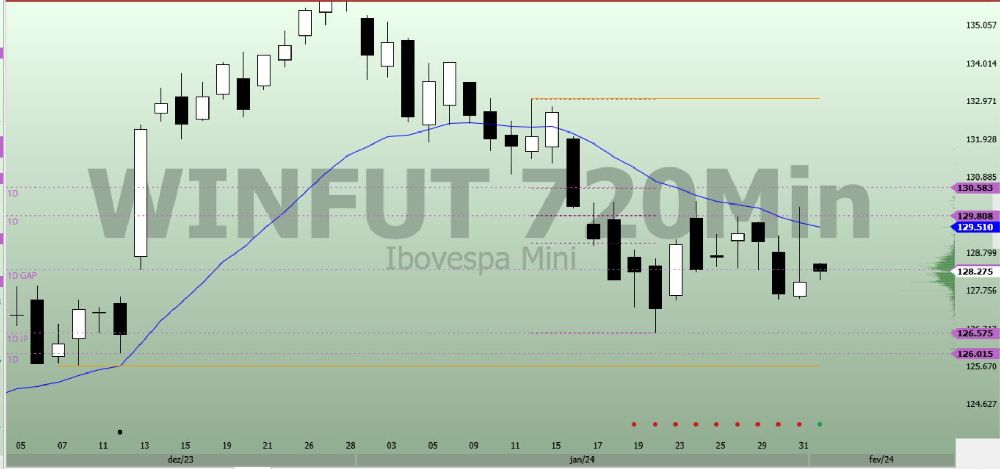

# Fevereiro

## Dias do Mês - Macro Intraday

| Barra | Leitura
|-------|-----
| Pre-Market Macro | **Macro** **Desequilíbrio Forte Comprador**
| Pre-Market Macro Intraday | **EQ**:  **Baixo 100** **Alto 8**
| GAP | **DMFV**: Grande GAP 595 PTS, **Momentum Venda**
| B01 |
| B02 |
| B03 |
| B04 |
| B05 |
| B06 |
| B07 |
| B08 |
| B09 |
| B10 |
| B11 |
| B12 |
| B13 |
| B14 |
| B15 |
| B16 |
| B17 |
| B18 |
| B19 |
| B20 |
| B21 |
| B22 |
| B23 |
| B24 |
| B25 |
| B26 |
| B27 |
| B28 |
| B29 |
| B30 |
| B31 |
| B32 |
| B33 |
| B34 |
| B35 |
| B36 |
| B37 |
| B38 |
| B39 |
| B40 |
| B41 |
| B42 |
| B43 |
| B44 |
| B45 |
| B46 |
| B47 |
| B48 |
| B49 |
| B50 |
| B51 |
| B52 |
| B53 |
| B54 |
| B55 |
| B56 |
| B57 |
| B58 |
| B59 |
| B60 |
| B61 |
| B62 |
| B63 |
| B64 |
| B65 |
| B66 |
| B67 |
| B68 |
| B69 |
| B70 |

## 01 de Fevereiro - Macro Intraday

5M

| Barra | Leitura
|-------|-----
| Pre-Market Macro | **Macro** **Desequilíbrio Fraco Comprador** Ausência de compradores acima de 29/01. Não são esperados compradores acima de 29/01 nem vendedores abaixo de 22/01.
| Pre-Market Macro Intraday | **Desequilíbrio Forte Vendedor**:  Troca de intenção ocorreu em B100. **Alto 94**, região de atenção para **Baixo B1**, mas dada a intenção a região pode ser ignorada.
| GAP | **DMFV**: Grande GAP 595 PTS, **Momentum Venda**
| B01 |
| B02 |
| B03 |
| B04 |
| B05 |
| B06 |
| B07 |
| B08 |
| B09 |
| B10 |
| B11 |
| B12 |
| B13 |
| B14 |
| B15 |
| B16 |
| B17 |
| B18 |
| B19 |
| B20 |